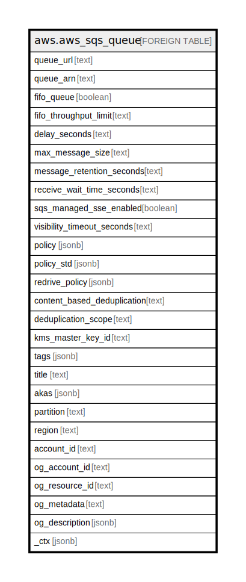

# aws.aws_sqs_queue

## Description

AWS SQS Queue

## Columns

| Name | Type | Default | Nullable | Children | Parents | Comment |
| ---- | ---- | ------- | -------- | -------- | ------- | ------- |
| queue_url | text |  | true |  |  | The URL of the Amazon SQS queue. |
| queue_arn | text |  | true |  |  | The Amazon resource name (ARN) of the queue. |
| fifo_queue | boolean |  | true |  |  | Returns true if the queue is FIFO. |
| fifo_throughput_limit | text |  | true |  |  | Specifies whether the FIFO queue throughput quota applies to the entire queue or per message group. |
| delay_seconds | text |  | true |  |  | The default delay on the queue in seconds. |
| max_message_size | text |  | true |  |  | The limit of how many bytes a message can contain before Amazon SQS rejects it. |
| message_retention_seconds | text |  | true |  |  | The length of time, in seconds, for which Amazon SQS retains a message. |
| receive_wait_time_seconds | text |  | true |  |  | The length of time, in seconds, for which the ReceiveMessage action waits for a message to arrive. |
| sqs_managed_sse_enabled | boolean |  | true |  |  | Returns true if the queue is using SSE-SQS encryption with SQS-owned encryption keys. |
| visibility_timeout_seconds | text |  | true |  |  | The visibility timeout for the queue in seconds. |
| policy | jsonb |  | true |  |  | The resource IAM policy of the queue. |
| policy_std | jsonb |  | true |  |  | Contains the policy in a canonical form for easier searching. |
| redrive_policy | jsonb |  | true |  |  | The string that includes the parameters for the dead-letter queue functionality of the source queue as a JSON object. |
| content_based_deduplication | text |  | true |  |  | Mentions whether content-based deduplication is enabled for the queue. |
| deduplication_scope | text |  | true |  |  | Specifies whether message deduplication occurs at the message group or queue level. |
| kms_master_key_id | text |  | true |  |  | the ID of an AWS-managed customer master key (CMK) for Amazon SQS or a custom CMK. |
| tags | jsonb |  | true |  |  | A map of tags for the resource. |
| title | text |  | true |  |  | Title of the resource. |
| akas | jsonb |  | true |  |  | Array of globally unique identifier strings (also known as) for the resource. |
| partition | text |  | true |  |  | The AWS partition in which the resource is located (aws, aws-cn, or aws-us-gov). |
| region | text |  | true |  |  | The AWS Region in which the resource is located. |
| account_id | text |  | true |  |  | The AWS Account ID in which the resource is located. |
| og_account_id | text |  | true |  |  | The Platform Account ID in which the resource is located. |
| og_resource_id | text |  | true |  |  | The unique ID of the resource in opengovernance. |
| og_metadata | text |  | true |  |  | Platform Metadata of the AWS resource. |
| og_description | jsonb |  | true |  |  | The full model description of the resource |
| _ctx | jsonb |  | true |  |  | Steampipe context in JSON form, e.g. connection_name. |

## Relations

---

> Generated by [tbls](https://github.com/k1LoW/tbls)
