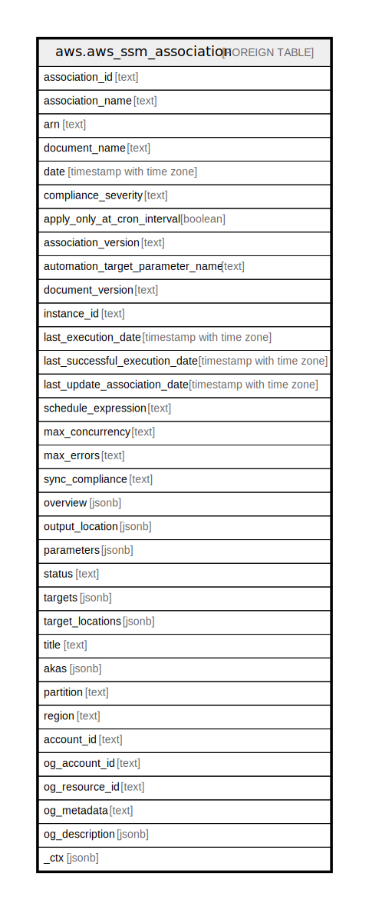

# aws.aws_ssm_association

## Description

AWS SSM Association

## Columns

| Name | Type | Default | Nullable | Children | Parents | Comment |
| ---- | ---- | ------- | -------- | -------- | ------- | ------- |
| association_id | text |  | true |  |  | The ID created by the system when you create an association. |
| association_name | text |  | true |  |  | The Name of association. |
| arn | text |  | true |  |  | The Amazon Resource Name (ARN) specifying the association. |
| document_name | text |  | true |  |  | The name of the Systems Manager document. |
| date | timestamp with time zone |  | true |  |  | The date when the association was made. |
| compliance_severity | text |  | true |  |  | A cron expression that specifies a schedule when the association runs. |
| apply_only_at_cron_interval | boolean |  | true |  |  | By default, when you create a new associations, the system runs it immediately after it is created and then according to the schedule you specified. Specify this option if you don't want an association to run immediately after you create it. This parameter is not supported for rate expressions. |
| association_version | text |  | true |  |  | The association version. |
| automation_target_parameter_name | text |  | true |  |  | Specify the target for the association. This target is required for associations that use an Automation document and target resources by using rate controls. |
| document_version | text |  | true |  |  | The version of the document used in the association. |
| instance_id | text |  | true |  |  | The ID of the instance. |
| last_execution_date | timestamp with time zone |  | true |  |  | The date on which the association was last run. |
| last_successful_execution_date | timestamp with time zone |  | true |  |  | The last date on which the association was successfully run. |
| last_update_association_date | timestamp with time zone |  | true |  |  | The date when the association was last updated. |
| schedule_expression | text |  | true |  |  | A cron expression that specifies a schedule when the association runs. |
| max_concurrency | text |  | true |  |  | The maximum number of targets allowed to run the association at the same time. |
| max_errors | text |  | true |  |  | The number of errors that are allowed before the system stops sending requests to run the association on additional targets. |
| sync_compliance | text |  | true |  |  | The mode for generating association compliance. You can specify AUTO or MANUAL. |
| overview | jsonb |  | true |  |  | Information about the association. |
| output_location | jsonb |  | true |  |  | An S3 bucket where you want to store the output details of the request. |
| parameters | jsonb |  | true |  |  | A description of the parameters for a document. |
| status | text |  | true |  |  | The status of the association. Status can be: Pending, Success, or Failed. |
| targets | jsonb |  | true |  |  | A cron expression that specifies a schedule when the association runs. |
| target_locations | jsonb |  | true |  |  | The combination of AWS Regions and AWS accounts where you want to run the association. |
| title | text |  | true |  |  | Title of the resource. |
| akas | jsonb |  | true |  |  | Array of globally unique identifier strings (also known as) for the resource. |
| partition | text |  | true |  |  | The AWS partition in which the resource is located (aws, aws-cn, or aws-us-gov). |
| region | text |  | true |  |  | The AWS Region in which the resource is located. |
| account_id | text |  | true |  |  | The AWS Account ID in which the resource is located. |
| og_account_id | text |  | true |  |  | The Platform Account ID in which the resource is located. |
| og_resource_id | text |  | true |  |  | The unique ID of the resource in opengovernance. |
| og_metadata | text |  | true |  |  | Platform Metadata of the AWS resource. |
| og_description | jsonb |  | true |  |  | The full model description of the resource |
| _ctx | jsonb |  | true |  |  | Steampipe context in JSON form, e.g. connection_name. |

## Relations

---

> Generated by [tbls](https://github.com/k1LoW/tbls)
