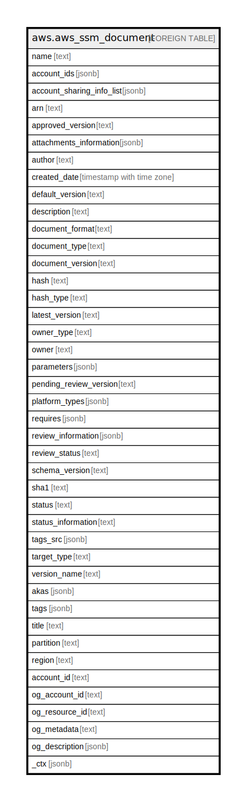

# aws.aws_ssm_document

## Description

AWS SSM Document

## Columns

| Name | Type | Default | Nullable | Children | Parents | Comment |
| ---- | ---- | ------- | -------- | -------- | ------- | ------- |
| name | text |  | true |  |  | The name of the Systems Manager document. |
| account_ids | jsonb |  | true |  |  | The account IDs that have permission to use this document.The ID can be either an AWS account or All. |
| account_sharing_info_list | jsonb |  | true |  |  | A list of AWS accounts where the current document is shared and the version shared with each account. |
| arn | text |  | true |  |  | The Amazon Resource Name (ARN) of the document. |
| approved_version | text |  | true |  |  | The version of the document currently approved for use in the organization. |
| attachments_information | jsonb |  | true |  |  | Details about the document attachments, including names, locations, sizes,and so on. |
| author | text |  | true |  |  | The user in your organization who created the document. |
| created_date | timestamp with time zone |  | true |  |  | The date when the document was created. |
| default_version | text |  | true |  |  | The default version. |
| description | text |  | true |  |  | A description of the document. |
| document_format | text |  | true |  |  | The document format, either JSON or YAML. |
| document_type | text |  | true |  |  | The type of document. |
| document_version | text |  | true |  |  | The document version. |
| hash | text |  | true |  |  | The Sha256 or Sha1 hash created by the system when the document was created. |
| hash_type | text |  | true |  |  | The hash type of the document. |
| latest_version | text |  | true |  |  | The latest version of the document. |
| owner_type | text |  | true |  |  | The AWS user account type to filter the documents. Possible values: Self, Amazon, Public, Private, ThirdParty, All, Default. |
| owner | text |  | true |  |  | The AWS user account that created the document. |
| parameters | jsonb |  | true |  |  | A description of the parameters for a document. |
| pending_review_version | text |  | true |  |  | The version of the document that is currently under review. |
| platform_types | jsonb |  | true |  |  | The operating system platform. |
| requires | jsonb |  | true |  |  | A list of SSM documents required by a document. |
| review_information | jsonb |  | true |  |  | Details about the review of a document. |
| review_status | text |  | true |  |  | The current status of the review. |
| schema_version | text |  | true |  |  | The schema version. |
| sha1 | text |  | true |  |  | The SHA1 hash of the document, which you can use for verification. |
| status | text |  | true |  |  | The user in your organization who created the document. |
| status_information | text |  | true |  |  | A message returned by AWS Systems Manager that explains the Status value. |
| tags_src | jsonb |  | true |  |  | A list of tags associated with document |
| target_type | text |  | true |  |  | The target type which defines the kinds of resources the document can run on. |
| version_name | text |  | true |  |  | The version of the artifact associated with the document. |
| akas | jsonb |  | true |  |  | Array of globally unique identifier strings (also known as) for the resource. |
| tags | jsonb |  | true |  |  | A map of tags for the resource. |
| title | text |  | true |  |  | Title of the resource. |
| partition | text |  | true |  |  | The AWS partition in which the resource is located (aws, aws-cn, or aws-us-gov). |
| region | text |  | true |  |  | The AWS Region in which the resource is located. |
| account_id | text |  | true |  |  | The AWS Account ID in which the resource is located. |
| og_account_id | text |  | true |  |  | The Platform Account ID in which the resource is located. |
| og_resource_id | text |  | true |  |  | The unique ID of the resource in opengovernance. |
| og_metadata | text |  | true |  |  | Platform Metadata of the AWS resource. |
| og_description | jsonb |  | true |  |  | The full model description of the resource |
| _ctx | jsonb |  | true |  |  | Steampipe context in JSON form, e.g. connection_name. |

## Relations

---

> Generated by [tbls](https://github.com/k1LoW/tbls)
