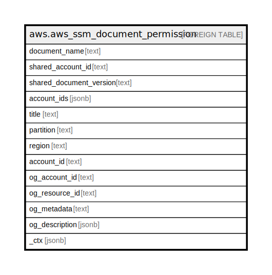

# aws.aws_ssm_document_permission

## Description

AWS SSM Document Permission

## Columns

| Name | Type | Default | Nullable | Children | Parents | Comment |
| ---- | ---- | ------- | -------- | -------- | ------- | ------- |
| document_name | text |  | true |  |  | The name of the Systems Manager document. |
| shared_account_id | text |  | true |  |  | The Amazon Web Services account ID where the current document is shared. |
| shared_document_version | text |  | true |  |  | The version of the current document shared with the account. |
| account_ids | jsonb |  | true |  |  | The account IDs that have permission to use this document. The ID can be either an AWS account or All. |
| title | text |  | true |  |  | Title of the resource. |
| partition | text |  | true |  |  | The AWS partition in which the resource is located (aws, aws-cn, or aws-us-gov). |
| region | text |  | true |  |  | The AWS Region in which the resource is located. |
| account_id | text |  | true |  |  | The AWS Account ID in which the resource is located. |
| og_account_id | text |  | true |  |  | The Platform Account ID in which the resource is located. |
| og_resource_id | text |  | true |  |  | The unique ID of the resource in opengovernance. |
| og_metadata | text |  | true |  |  | Platform Metadata of the AWS resource. |
| og_description | jsonb |  | true |  |  | The full model description of the resource |
| _ctx | jsonb |  | true |  |  | Steampipe context in JSON form, e.g. connection_name. |

## Relations

---

> Generated by [tbls](https://github.com/k1LoW/tbls)
