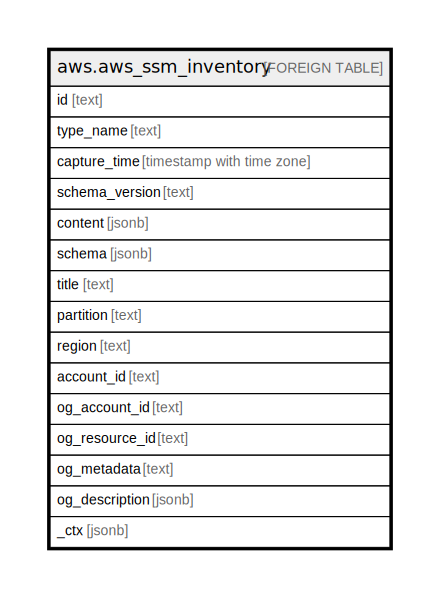

# aws.aws_ssm_inventory

## Description

AWS SSM Inventory

## Columns

| Name | Type | Default | Nullable | Children | Parents | Comment |
| ---- | ---- | ------- | -------- | -------- | ------- | ------- |
| id | text |  | true |  |  | ID of the inventory result entity. |
| type_name | text |  | true |  |  | The type of inventory item returned by the request. |
| capture_time | timestamp with time zone |  | true |  |  | The time that inventory information was collected for the managed node(s). |
| schema_version | text |  | true |  |  | The inventory schema version used by the managed node(s). |
| content | jsonb |  | true |  |  | Contains all the inventory data of the item type. Results include attribute names and values. |
| schema | jsonb |  | true |  |  | The inventory item schema definition. Users can use this to compose inventory query filters. |
| title | text |  | true |  |  | Title of the resource. |
| partition | text |  | true |  |  | The AWS partition in which the resource is located (aws, aws-cn, or aws-us-gov). |
| region | text |  | true |  |  | The AWS Region in which the resource is located. |
| account_id | text |  | true |  |  | The AWS Account ID in which the resource is located. |
| og_account_id | text |  | true |  |  | The Platform Account ID in which the resource is located. |
| og_resource_id | text |  | true |  |  | The unique ID of the resource in opengovernance. |
| og_metadata | text |  | true |  |  | Platform Metadata of the AWS resource. |
| og_description | jsonb |  | true |  |  | The full model description of the resource |
| _ctx | jsonb |  | true |  |  | Steampipe context in JSON form, e.g. connection_name. |

## Relations

---

> Generated by [tbls](https://github.com/k1LoW/tbls)
