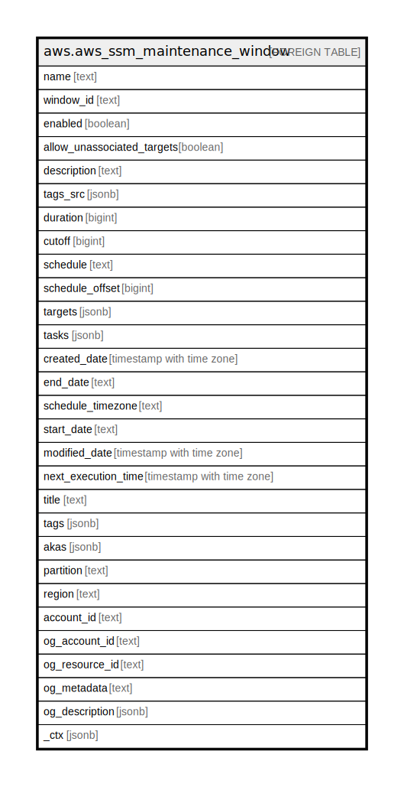

# aws.aws_ssm_maintenance_window

## Description

AWS SSM Maintenance Window

## Columns

| Name | Type | Default | Nullable | Children | Parents | Comment |
| ---- | ---- | ------- | -------- | -------- | ------- | ------- |
| name | text |  | true |  |  | The name of the Maintenance Window. |
| window_id | text |  | true |  |  | The ID of the Maintenance Window. |
| enabled | boolean |  | true |  |  | Indicates whether the Maintenance Window is enabled. |
| allow_unassociated_targets | boolean |  | true |  |  | Indicates whether targets must be registered with the Maintenance Window before tasks can be defined for those targets. |
| description | text |  | true |  |  | A description of the Maintenance Window. |
| tags_src | jsonb |  | true |  |  | A list of tags assigned to the Maintenance Window |
| duration | bigint |  | true |  |  | The duration of the Maintenance Window in hours. |
| cutoff | bigint |  | true |  |  | The number of hours before the end of the Maintenance Window that Systems Manager stops scheduling new tasks for execution. |
| schedule | text |  | true |  |  | The schedule of the Maintenance Window in the form of a cron or rate expression. |
| schedule_offset | bigint |  | true |  |  | The number of days to wait to run a Maintenance Window after the scheduled CRON expression date and time. |
| targets | jsonb |  | true |  |  | The targets of Maintenance Window. |
| tasks | jsonb |  | true |  |  | The Tasks of Maintenance Window. |
| created_date | timestamp with time zone |  | true |  |  | The date the maintenance window was created. |
| end_date | text |  | true |  |  | The date and time, in ISO-8601 Extended format, for when the maintenance window is scheduled to become inactive. The maintenance window will not run after this specified time. |
| schedule_timezone | text |  | true |  |  | The schedule of the maintenance window in the form of a cron or rate expression. |
| start_date | text |  | true |  |  | The date and time, in ISO-8601 Extended format, for when the maintenance window is scheduled to become active. |
| modified_date | timestamp with time zone |  | true |  |  | The date the Maintenance Window was last modified. |
| next_execution_time | timestamp with time zone |  | true |  |  | The next time the maintenance window will actually run, taking into account any specified times for the Maintenance Window to become active or inactive. |
| title | text |  | true |  |  | Title of the resource. |
| tags | jsonb |  | true |  |  | A map of tags for the resource. |
| akas | jsonb |  | true |  |  | Array of globally unique identifier strings (also known as) for the resource. |
| partition | text |  | true |  |  | The AWS partition in which the resource is located (aws, aws-cn, or aws-us-gov). |
| region | text |  | true |  |  | The AWS Region in which the resource is located. |
| account_id | text |  | true |  |  | The AWS Account ID in which the resource is located. |
| og_account_id | text |  | true |  |  | The Platform Account ID in which the resource is located. |
| og_resource_id | text |  | true |  |  | The unique ID of the resource in opengovernance. |
| og_metadata | text |  | true |  |  | Platform Metadata of the AWS resource. |
| og_description | jsonb |  | true |  |  | The full model description of the resource |
| _ctx | jsonb |  | true |  |  | Steampipe context in JSON form, e.g. connection_name. |

## Relations

---

> Generated by [tbls](https://github.com/k1LoW/tbls)
