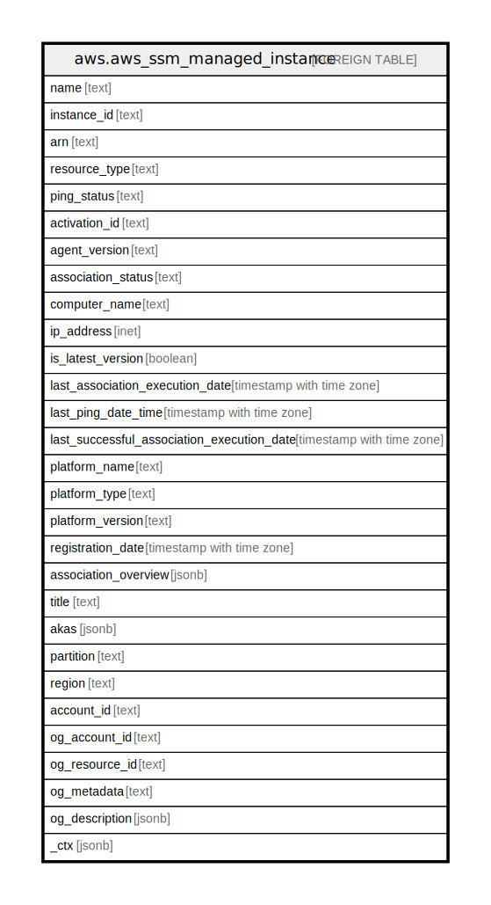

# aws.aws_ssm_managed_instance

## Description

AWS SSM Managed Instance

## Columns

| Name | Type | Default | Nullable | Children | Parents | Comment |
| ---- | ---- | ------- | -------- | -------- | ------- | ------- |
| name | text |  | true |  |  | The name assigned to an on-premises server or virtual machine (VM) when it is activated as a Systems Manager managed instance. |
| instance_id | text |  | true |  |  | The ID of the instance. |
| arn | text |  | true |  |  | The Amazon Resource Name (ARN) specifying the instance. |
| resource_type | text |  | true |  |  | The type of instance. Instances are either EC2 instances or managed instances. |
| ping_status | text |  | true |  |  | Connection status of SSM Agent. |
| activation_id | text |  | true |  |  | The activation ID created by Systems Manager when the server or VM was registered. |
| agent_version | text |  | true |  |  | The version of SSM Agent running on your Linux instance. |
| association_status | text |  | true |  |  | The status of the association. |
| computer_name | text |  | true |  |  | The fully qualified host name of the managed instance. |
| ip_address | inet |  | true |  |  | The IP address of the managed instance. |
| is_latest_version | boolean |  | true |  |  | Indicates whether the latest version of SSM Agent is running on your Linux Managed Instance. |
| last_association_execution_date | timestamp with time zone |  | true |  |  | The date the association was last run. |
| last_ping_date_time | timestamp with time zone |  | true |  |  | The date and time when the agent last pinged the Systems Manager service. |
| last_successful_association_execution_date | timestamp with time zone |  | true |  |  | The last date the association was successfully run. |
| platform_name | text |  | true |  |  | The name of the operating system platform running on your instance. |
| platform_type | text |  | true |  |  | The operating system platform type. |
| platform_version | text |  | true |  |  | The version of the OS platform running on your instance. |
| registration_date | timestamp with time zone |  | true |  |  | The date the server or VM was registered with AWS as a managed instance. |
| association_overview | jsonb |  | true |  |  | Information about the association. |
| title | text |  | true |  |  | Title of the resource. |
| akas | jsonb |  | true |  |  | Array of globally unique identifier strings (also known as) for the resource. |
| partition | text |  | true |  |  | The AWS partition in which the resource is located (aws, aws-cn, or aws-us-gov). |
| region | text |  | true |  |  | The AWS Region in which the resource is located. |
| account_id | text |  | true |  |  | The AWS Account ID in which the resource is located. |
| og_account_id | text |  | true |  |  | The Platform Account ID in which the resource is located. |
| og_resource_id | text |  | true |  |  | The unique ID of the resource in opengovernance. |
| og_metadata | text |  | true |  |  | Platform Metadata of the AWS resource. |
| og_description | jsonb |  | true |  |  | The full model description of the resource |
| _ctx | jsonb |  | true |  |  | Steampipe context in JSON form, e.g. connection_name. |

## Relations

---

> Generated by [tbls](https://github.com/k1LoW/tbls)
