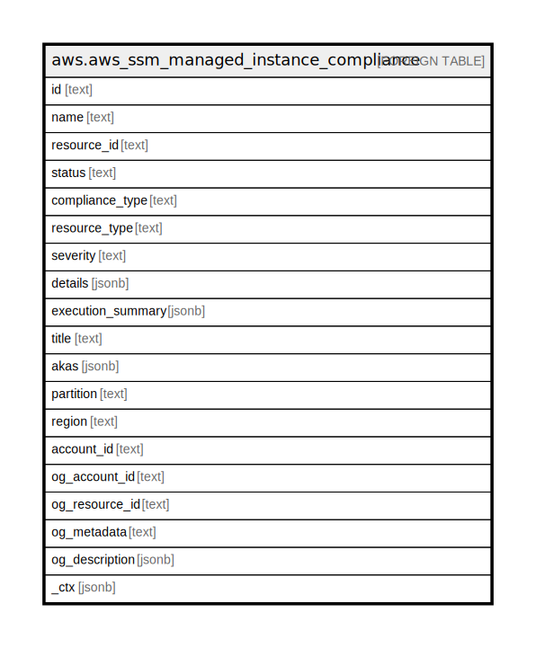

# aws.aws_ssm_managed_instance_compliance

## Description

AWS SSM Managed Instance Compliance

## Columns

| Name | Type | Default | Nullable | Children | Parents | Comment |
| ---- | ---- | ------- | -------- | -------- | ------- | ------- |
| id | text |  | true |  |  | An ID for the compliance item. |
| name | text |  | true |  |  | A title for the compliance item. |
| resource_id | text |  | true |  |  | An ID for the resource. |
| status | text |  | true |  |  | The status of the compliance item. |
| compliance_type | text |  | true |  |  | The compliance type. |
| resource_type | text |  | true |  |  | The type of resource. |
| severity | text |  | true |  |  | The severity of the compliance status. |
| details | jsonb |  | true |  |  | A key-value combination details for the compliance item. |
| execution_summary | jsonb |  | true |  |  | A summary for the compliance item. |
| title | text |  | true |  |  | Title of the resource. |
| akas | jsonb |  | true |  |  | Array of globally unique identifier strings (also known as) for the resource. |
| partition | text |  | true |  |  | The AWS partition in which the resource is located (aws, aws-cn, or aws-us-gov). |
| region | text |  | true |  |  | The AWS Region in which the resource is located. |
| account_id | text |  | true |  |  | The AWS Account ID in which the resource is located. |
| og_account_id | text |  | true |  |  | The Platform Account ID in which the resource is located. |
| og_resource_id | text |  | true |  |  | The unique ID of the resource in opengovernance. |
| og_metadata | text |  | true |  |  | Platform Metadata of the AWS resource. |
| og_description | jsonb |  | true |  |  | The full model description of the resource |
| _ctx | jsonb |  | true |  |  | Steampipe context in JSON form, e.g. connection_name. |

## Relations

---

> Generated by [tbls](https://github.com/k1LoW/tbls)
