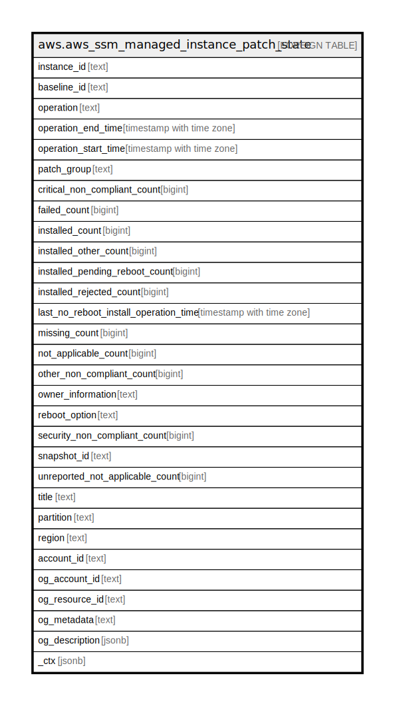

# aws.aws_ssm_managed_instance_patch_state

## Description

AWS SSM Managed Instance Patch State

## Columns

| Name | Type | Default | Nullable | Children | Parents | Comment |
| ---- | ---- | ------- | -------- | -------- | ------- | ------- |
| instance_id | text |  | true |  |  | The ID of the managed node the high-level patch compliance information was collected for. |
| baseline_id | text |  | true |  |  | The ID of the patch baseline used to patch the managed node. |
| operation | text |  | true |  |  | The type of patching operation that was performed. |
| operation_end_time | timestamp with time zone |  | true |  |  | The time the most recent patching operation completed on the managed node. |
| operation_start_time | timestamp with time zone |  | true |  |  | The time the most recent patching operation was started on the managed node. |
| patch_group | text |  | true |  |  | The name of the patch group the managed node belongs to. |
| critical_non_compliant_count | bigint |  | true |  |  | The number of patches per node that are specified as Critical for compliance reporting in the patch baseline aren't installed. These patches might be missing, have failed installation, were rejected, or were installed but awaiting a required managed node reboot. The status of these managed nodes is NON_COMPLIANT. |
| failed_count | bigint |  | true |  |  | The number of patches from the patch baseline that were attempted to be installed during the last patching operation, but failed to install. |
| installed_count | bigint |  | true |  |  | The number of patches from the patch baseline that are installed on the managed node. |
| installed_other_count | bigint |  | true |  |  | The number of patches not specified in the patch baseline that are installed on the managed node. |
| installed_pending_reboot_count | bigint |  | true |  |  | The number of patches installed by Patch Manager since the last time the managed node was rebooted. |
| installed_rejected_count | bigint |  | true |  |  | The number of patches installed on a managed node that are specified in a RejectedPatches list. Patches with a status of InstalledRejected were typically installed before they were added to a RejectedPatches list. |
| last_no_reboot_install_operation_time | timestamp with time zone |  | true |  |  | The time of the last attempt to patch the managed node with NoReboot specified as the reboot option. |
| missing_count | bigint |  | true |  |  | The number of patches from the patch baseline that are applicable for the managed node but aren't currently installed. |
| not_applicable_count | bigint |  | true |  |  | The number of patches from the patch baseline that aren't applicable for the managed node and therefore aren't installed on the node. This number may be truncated if the list of patch names is very large. The number of patches beyond this limit are reported in UnreportedNotApplicableCount. |
| other_non_compliant_count | bigint |  | true |  |  | The number of patches per node that are specified as other than Critical or Security but aren't compliant with the patch baseline. The status of these managed nodes is NON_COMPLIANT. |
| owner_information | text |  | true |  |  | Placeholder information. This field will always be empty in the current release of the service. |
| reboot_option | text |  | true |  |  | Indicates the reboot option specified in the patch baseline. Reboot options apply to Install operations only. Reboots aren't attempted for Patch Manager Scan operations. |
| security_non_compliant_count | bigint |  | true |  |  | The number of patches per node that are specified as Security in a patch advisory aren't installed. These patches might be missing, have failed installation, were rejected, or were installed but awaiting a required managed node reboot. The status of these managed nodes is NON_COMPLIANT. |
| snapshot_id | text |  | true |  |  | The ID of the patch baseline snapshot used during the patching operation when this compliance data was collected. |
| unreported_not_applicable_count | bigint |  | true |  |  | The number of patches beyond the supported limit of NotApplicableCount that aren't reported by name to Inventory. Inventory is a capability of Amazon Web Services Systems Manager. |
| title | text |  | true |  |  | Title of the resource. |
| partition | text |  | true |  |  | The AWS partition in which the resource is located (aws, aws-cn, or aws-us-gov). |
| region | text |  | true |  |  | The AWS Region in which the resource is located. |
| account_id | text |  | true |  |  | The AWS Account ID in which the resource is located. |
| og_account_id | text |  | true |  |  | The Platform Account ID in which the resource is located. |
| og_resource_id | text |  | true |  |  | The unique ID of the resource in opengovernance. |
| og_metadata | text |  | true |  |  | Platform Metadata of the AWS resource. |
| og_description | jsonb |  | true |  |  | The full model description of the resource |
| _ctx | jsonb |  | true |  |  | Steampipe context in JSON form, e.g. connection_name. |

## Relations

---

> Generated by [tbls](https://github.com/k1LoW/tbls)
