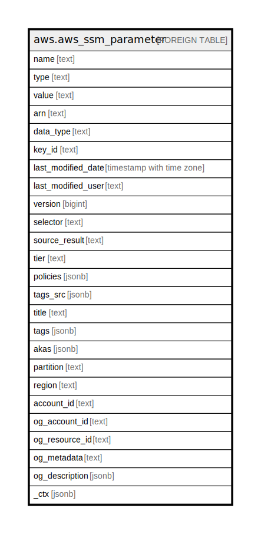

# aws.aws_ssm_parameter

## Description

AWS SSM Parameter

## Columns

| Name | Type | Default | Nullable | Children | Parents | Comment |
| ---- | ---- | ------- | -------- | -------- | ------- | ------- |
| name | text |  | true |  |  | The parameter name. |
| type | text |  | true |  |  | The type of parameter. Valid parameter types include the following: String, StringList, and SecureString. |
| value | text |  | true |  |  | The value of parameter. |
| arn | text |  | true |  |  | The Amazon Resource Name (ARN) of the parameter. |
| data_type | text |  | true |  |  | The data type of the parameter, such as text or aws:ec2:image. The default is text. |
| key_id | text |  | true |  |  | The ID of the query key used for this parameter. |
| last_modified_date | timestamp with time zone |  | true |  |  | Date the parameter was last changed or updated. |
| last_modified_user | text |  | true |  |  | Amazon Resource Name (ARN) of the AWS user who last changed the parameter. |
| version | bigint |  | true |  |  | The parameter version. |
| selector | text |  | true |  |  | Either the version number or the label used to retrieve the parameter value. |
| source_result | text |  | true |  |  | SourceResult is the raw result or response from the source. Applies to parameters that reference information in other AWS services. |
| tier | text |  | true |  |  | The parameter tier. |
| policies | jsonb |  | true |  |  | A list of policies associated with a parameter. Parameter policies help you manage a growing set of parameters by enabling you to assign specific criteria to a parameter such as an expiration date or time to live. Parameter policies are especially helpful in forcing you to update or delete passwords and configuration data stored in Parameter Store. |
| tags_src | jsonb |  | true |  |  | A list of tags assigned to the parameter. |
| title | text |  | true |  |  | Title of the resource. |
| tags | jsonb |  | true |  |  | A map of tags for the resource. |
| akas | jsonb |  | true |  |  | Array of globally unique identifier strings (also known as) for the resource. |
| partition | text |  | true |  |  | The AWS partition in which the resource is located (aws, aws-cn, or aws-us-gov). |
| region | text |  | true |  |  | The AWS Region in which the resource is located. |
| account_id | text |  | true |  |  | The AWS Account ID in which the resource is located. |
| og_account_id | text |  | true |  |  | The Platform Account ID in which the resource is located. |
| og_resource_id | text |  | true |  |  | The unique ID of the resource in opengovernance. |
| og_metadata | text |  | true |  |  | Platform Metadata of the AWS resource. |
| og_description | jsonb |  | true |  |  | The full model description of the resource |
| _ctx | jsonb |  | true |  |  | Steampipe context in JSON form, e.g. connection_name. |

## Relations

---

> Generated by [tbls](https://github.com/k1LoW/tbls)
