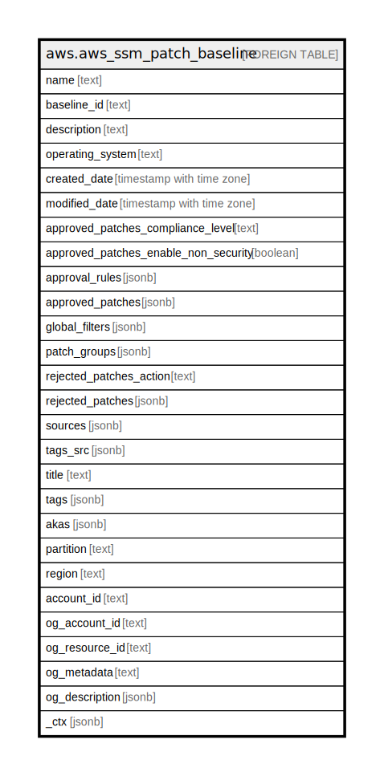

# aws.aws_ssm_patch_baseline

## Description

AWS SSM Patch Baseline

## Columns

| Name | Type | Default | Nullable | Children | Parents | Comment |
| ---- | ---- | ------- | -------- | -------- | ------- | ------- |
| name | text |  | true |  |  | The name of the patch baseline. |
| baseline_id | text |  | true |  |  | The ID of the retrieved patch baseline. |
| description | text |  | true |  |  | A description of the patch baseline. |
| operating_system | text |  | true |  |  | Returns the operating system specified for the patch baseline. |
| created_date | timestamp with time zone |  | true |  |  | The date the patch baseline was created. |
| modified_date | timestamp with time zone |  | true |  |  | The date the patch baseline was last modified. |
| approved_patches_compliance_level | text |  | true |  |  | Returns the specified compliance severity level for approved patches in the patch baseline. |
| approved_patches_enable_non_security | boolean |  | true |  |  | Indicates whether the list of approved patches includes non-security updates that should be applied to the instances. The default value is 'false'. Applies to Linux instances only. |
| approval_rules | jsonb |  | true |  |  | A set of rules used to include patches in the baseline. |
| approved_patches | jsonb |  | true |  |  | A list of explicitly approved patches for the baseline. |
| global_filters | jsonb |  | true |  |  | A set of global filters used to exclude patches from the baseline. |
| patch_groups | jsonb |  | true |  |  | Patch groups included in the patch baseline. |
| rejected_patches_action | text |  | true |  |  | The action specified to take on patches included in the RejectedPatches list. A patch can be allowed only if it is a dependency of another package, or blocked entirely along with packages that include it as a dependency. |
| rejected_patches | jsonb |  | true |  |  | A list of explicitly rejected patches for the baseline. |
| sources | jsonb |  | true |  |  | Information about the patches to use to update the instances, including target operating systems and source repositories. Applies to Linux instances only. |
| tags_src | jsonb |  | true |  |  | A list of tags assigned to the patch baseline. |
| title | text |  | true |  |  | Title of the resource. |
| tags | jsonb |  | true |  |  | A map of tags for the resource. |
| akas | jsonb |  | true |  |  | Array of globally unique identifier strings (also known as) for the resource. |
| partition | text |  | true |  |  | The AWS partition in which the resource is located (aws, aws-cn, or aws-us-gov). |
| region | text |  | true |  |  | The AWS Region in which the resource is located. |
| account_id | text |  | true |  |  | The AWS Account ID in which the resource is located. |
| og_account_id | text |  | true |  |  | The Platform Account ID in which the resource is located. |
| og_resource_id | text |  | true |  |  | The unique ID of the resource in opengovernance. |
| og_metadata | text |  | true |  |  | Platform Metadata of the AWS resource. |
| og_description | jsonb |  | true |  |  | The full model description of the resource |
| _ctx | jsonb |  | true |  |  | Steampipe context in JSON form, e.g. connection_name. |

## Relations

---

> Generated by [tbls](https://github.com/k1LoW/tbls)
