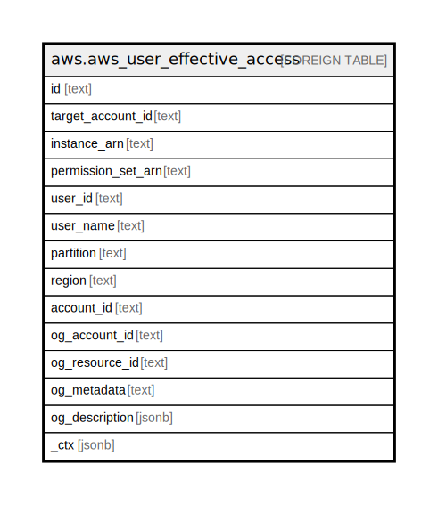

# aws.aws_user_effective_access

## Description

AWS User Effective Access

## Columns

| Name | Type | Default | Nullable | Children | Parents | Comment |
| ---- | ---- | ------- | -------- | -------- | ------- | ------- |
| id | text |  | true |  |  | Contains ID to identify a role assignment uniquely. |
| target_account_id | text |  | true |  |  | The identifier of the AWS account from which to list the assignments. |
| instance_arn | text |  | true |  |  | The Amazon Resource Name (ARN) of the SSO Instance under which the operation will be executed. |
| permission_set_arn | text |  | true |  |  | The ARN of the permission set from which to list assignments. |
| user_id | text |  | true |  |  | An identifier for an object in IAM Identity Center. |
| user_name | text |  | true |  |  | The user name. |
| partition | text |  | true |  |  | The AWS partition in which the resource is located (aws, aws-cn, or aws-us-gov). |
| region | text |  | true |  |  | The AWS Region in which the resource is located. |
| account_id | text |  | true |  |  | The AWS Account ID in which the resource is located. |
| og_account_id | text |  | true |  |  | The Platform Account ID in which the resource is located. |
| og_resource_id | text |  | true |  |  | The unique ID of the resource in opengovernance. |
| og_metadata | text |  | true |  |  | Platform Metadata of the AWS resource. |
| og_description | jsonb |  | true |  |  | The full model description of the resource |
| _ctx | jsonb |  | true |  |  | Steampipe context in JSON form, e.g. connection_name. |

## Relations

---

> Generated by [tbls](https://github.com/k1LoW/tbls)
