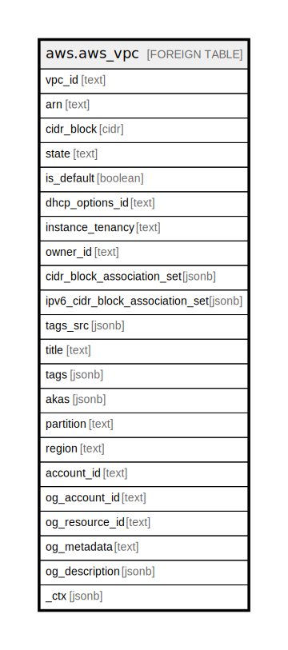

# aws.aws_vpc

## Description

AWS VPC

## Columns

| Name | Type | Default | Nullable | Children | Parents | Comment |
| ---- | ---- | ------- | -------- | -------- | ------- | ------- |
| vpc_id | text |  | true |  |  | The ID of the VPC. |
| arn | text |  | true |  |  | The Amazon Resource Name (ARN) specifying the vpc. |
| cidr_block | cidr |  | true |  |  | The primary IPv4 CIDR block for the VPC. |
| state | text |  | true |  |  | Contains the current state of the VPC. |
| is_default | boolean |  | true |  |  | Indicates whether the VPC is the default VPC. |
| dhcp_options_id | text |  | true |  |  | Contains the ID of the set of DHCP options, associated with the VPC. |
| instance_tenancy | text |  | true |  |  | The allowed tenancy of instances launched into the VPC. |
| owner_id | text |  | true |  |  | Contains ID of the AWS account that owns the VPC. |
| cidr_block_association_set | jsonb |  | true |  |  | Information about the IPv4 CIDR blocks associated with the VPC. |
| ipv6_cidr_block_association_set | jsonb |  | true |  |  | Information about the IPv6 CIDR blocks associated with the VPC. |
| tags_src | jsonb |  | true |  |  | A list of tags that are attached with the VPC. |
| title | text |  | true |  |  | Title of the resource. |
| tags | jsonb |  | true |  |  | A map of tags for the resource. |
| akas | jsonb |  | true |  |  | Array of globally unique identifier strings (also known as) for the resource. |
| partition | text |  | true |  |  | The AWS partition in which the resource is located (aws, aws-cn, or aws-us-gov). |
| region | text |  | true |  |  | The AWS Region in which the resource is located. |
| account_id | text |  | true |  |  | The AWS Account ID in which the resource is located. |
| og_account_id | text |  | true |  |  | The Platform Account ID in which the resource is located. |
| og_resource_id | text |  | true |  |  | The unique ID of the resource in opengovernance. |
| og_metadata | text |  | true |  |  | Platform Metadata of the AWS resource. |
| og_description | jsonb |  | true |  |  | The full model description of the resource |
| _ctx | jsonb |  | true |  |  | Steampipe context in JSON form, e.g. connection_name. |

## Relations

---

> Generated by [tbls](https://github.com/k1LoW/tbls)
