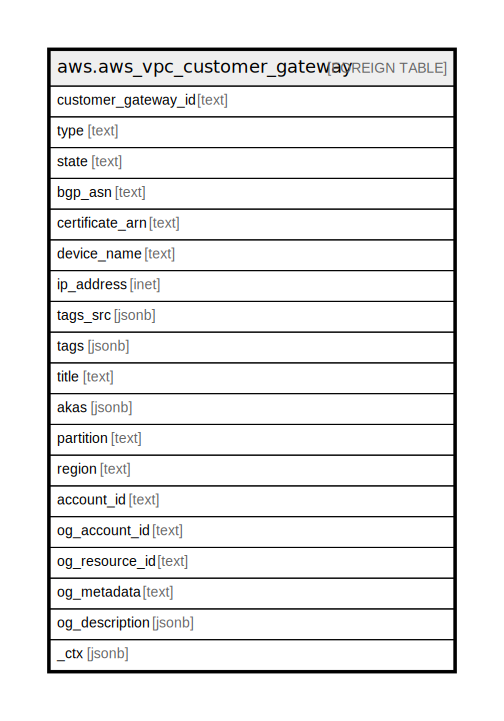

# aws.aws_vpc_customer_gateway

## Description

AWS VPC Customer Gateway

## Columns

| Name | Type | Default | Nullable | Children | Parents | Comment |
| ---- | ---- | ------- | -------- | -------- | ------- | ------- |
| customer_gateway_id | text |  | true |  |  | The ID of the customer gateway. |
| type | text |  | true |  |  | The type of VPN connection the customer gateway supports (ipsec.1). |
| state | text |  | true |  |  | The current state of the customer gateway (pending | available | deleting | deleted). |
| bgp_asn | text |  | true |  |  | The customer gateway's Border Gateway Protocol (BGP) Autonomous System Number (ASN). |
| certificate_arn | text |  | true |  |  | The Amazon Resource Name (ARN) for the customer gateway certificate. |
| device_name | text |  | true |  |  | The name of customer gateway device. |
| ip_address | inet |  | true |  |  | The Internet-routable IP address of the customer gateway's outside interface. |
| tags_src | jsonb |  | true |  |  | A list of tags that are attached to customer gateway. |
| tags | jsonb |  | true |  |  | A map of tags for the resource. |
| title | text |  | true |  |  | Title of the resource. |
| akas | jsonb |  | true |  |  | Array of globally unique identifier strings (also known as) for the resource. |
| partition | text |  | true |  |  | The AWS partition in which the resource is located (aws, aws-cn, or aws-us-gov). |
| region | text |  | true |  |  | The AWS Region in which the resource is located. |
| account_id | text |  | true |  |  | The AWS Account ID in which the resource is located. |
| og_account_id | text |  | true |  |  | The Platform Account ID in which the resource is located. |
| og_resource_id | text |  | true |  |  | The unique ID of the resource in opengovernance. |
| og_metadata | text |  | true |  |  | Platform Metadata of the AWS resource. |
| og_description | jsonb |  | true |  |  | The full model description of the resource |
| _ctx | jsonb |  | true |  |  | Steampipe context in JSON form, e.g. connection_name. |

## Relations

---

> Generated by [tbls](https://github.com/k1LoW/tbls)
