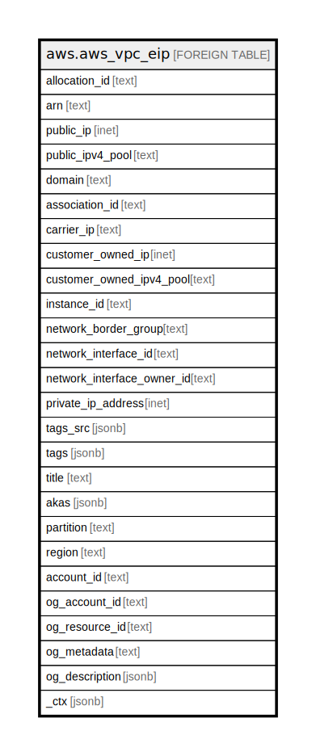

# aws.aws_vpc_eip

## Description

AWS VPC Elastic IP

## Columns

| Name | Type | Default | Nullable | Children | Parents | Comment |
| ---- | ---- | ------- | -------- | -------- | ------- | ------- |
| allocation_id | text |  | true |  |  | Contains the ID representing the allocation of the address for use with EC2-VPC. |
| arn | text |  | true |  |  | The Amazon Resource Name (ARN) specifying the VPC EIP. |
| public_ip | inet |  | true |  |  | Contains the Elastic IP address. |
| public_ipv4_pool | text |  | true |  |  | The ID of an address pool. |
| domain | text |  | true |  |  | Indicates whether Elastic IP address is for use with instances in EC2-Classic(standard) or instances in a VPC (vpc). |
| association_id | text |  | true |  |  | Contains the ID representing the association of the address with an instance in a VPC. |
| carrier_ip | text |  | true |  |  | The carrier IP address associated. This option is only available for network interfaces which reside in a subnet in a Wavelength Zone (for example an EC2 instance). |
| customer_owned_ip | inet |  | true |  |  | The customer-owned IP address. |
| customer_owned_ipv4_pool | text |  | true |  |  | The ID of the customer-owned address pool. |
| instance_id | text |  | true |  |  | Contains the ID of the instance that the address is associated with. |
| network_border_group | text |  | true |  |  | The name of the unique set of Availability Zones, Local Zones, or Wavelength Zones from which AWS advertises IP addresses. |
| network_interface_id | text |  | true |  |  | The ID of the network interface. |
| network_interface_owner_id | text |  | true |  |  | The ID of the AWS account that owns the network interface. |
| private_ip_address | inet |  | true |  |  | The private IP address associated with the Elastic IP address. |
| tags_src | jsonb |  | true |  |  | A list of tags that are attached to the vpc. |
| tags | jsonb |  | true |  |  | A map of tags for the resource. |
| title | text |  | true |  |  | Title of the resource. |
| akas | jsonb |  | true |  |  | Array of globally unique identifier strings (also known as) for the resource. |
| partition | text |  | true |  |  | The AWS partition in which the resource is located (aws, aws-cn, or aws-us-gov). |
| region | text |  | true |  |  | The AWS Region in which the resource is located. |
| account_id | text |  | true |  |  | The AWS Account ID in which the resource is located. |
| og_account_id | text |  | true |  |  | The Platform Account ID in which the resource is located. |
| og_resource_id | text |  | true |  |  | The unique ID of the resource in opengovernance. |
| og_metadata | text |  | true |  |  | Platform Metadata of the AWS resource. |
| og_description | jsonb |  | true |  |  | The full model description of the resource |
| _ctx | jsonb |  | true |  |  | Steampipe context in JSON form, e.g. connection_name. |

## Relations

---

> Generated by [tbls](https://github.com/k1LoW/tbls)
