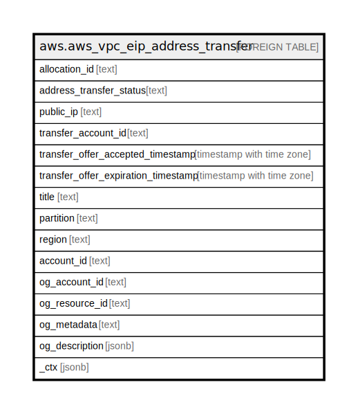

# aws.aws_vpc_eip_address_transfer

## Description

AWS VPC Elastic IP Address Transfer

## Columns

| Name | Type | Default | Nullable | Children | Parents | Comment |
| ---- | ---- | ------- | -------- | -------- | ------- | ------- |
| allocation_id | text |  | true |  |  | The allocation ID of an Elastic IP address. |
| address_transfer_status | text |  | true |  |  | The Elastic IP address transfer status. |
| public_ip | text |  | true |  |  | The Elastic IP address being transferred. |
| transfer_account_id | text |  | true |  |  | The ID of the account that you want to transfer the Elastic IP address to. |
| transfer_offer_accepted_timestamp | timestamp with time zone |  | true |  |  | The timestamp when the Elastic IP address transfer was accepted. |
| transfer_offer_expiration_timestamp | timestamp with time zone |  | true |  |  | The timestamp when the Elastic IP address transfer expired. |
| title | text |  | true |  |  | Title of the resource. |
| partition | text |  | true |  |  | The AWS partition in which the resource is located (aws, aws-cn, or aws-us-gov). |
| region | text |  | true |  |  | The AWS Region in which the resource is located. |
| account_id | text |  | true |  |  | The AWS Account ID in which the resource is located. |
| og_account_id | text |  | true |  |  | The Platform Account ID in which the resource is located. |
| og_resource_id | text |  | true |  |  | The unique ID of the resource in opengovernance. |
| og_metadata | text |  | true |  |  | Platform Metadata of the AWS resource. |
| og_description | jsonb |  | true |  |  | The full model description of the resource |
| _ctx | jsonb |  | true |  |  | Steampipe context in JSON form, e.g. connection_name. |

## Relations

---

> Generated by [tbls](https://github.com/k1LoW/tbls)
