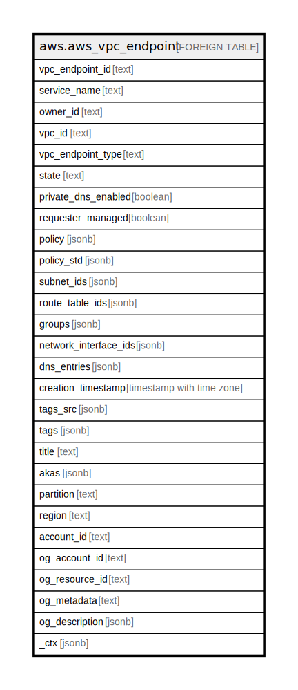

# aws.aws_vpc_endpoint

## Description

AWS VPC Endpoint

## Columns

| Name | Type | Default | Nullable | Children | Parents | Comment |
| ---- | ---- | ------- | -------- | -------- | ------- | ------- |
| vpc_endpoint_id | text |  | true |  |  | The ID of the VPC endpoint. |
| service_name | text |  | true |  |  | The name of the service to which the endpoint is associated. |
| owner_id | text |  | true |  |  | The ID of the AWS account that owns the VPC endpoint. |
| vpc_id | text |  | true |  |  | The ID of the VPC to which the endpoint is associated. |
| vpc_endpoint_type | text |  | true |  |  | The type of endpoint. |
| state | text |  | true |  |  | The state of the VPC endpoint. |
| private_dns_enabled | boolean |  | true |  |  | Indicates whether the VPC is associated with a private hosted zone. |
| requester_managed | boolean |  | true |  |  | Indicates whether the VPC endpoint is being managed by its service. |
| policy | jsonb |  | true |  |  | The policy document associated with the endpoint, if applicable. |
| policy_std | jsonb |  | true |  |  | Contains the policy in a canonical form for easier searching. |
| subnet_ids | jsonb |  | true |  |  | One or more subnets in which the endpoint is located. |
| route_table_ids | jsonb |  | true |  |  | One or more route tables associated with the endpoint. |
| groups | jsonb |  | true |  |  | Information about the security groups that are associated with the network interface. |
| network_interface_ids | jsonb |  | true |  |  | One or more network interfaces for the endpoint. |
| dns_entries | jsonb |  | true |  |  | The DNS entries for the endpoint. |
| creation_timestamp | timestamp with time zone |  | true |  |  | The date and time that the VPC endpoint was created. |
| tags_src | jsonb |  | true |  |  | A list of tags assigned to the VPC endpoint. |
| tags | jsonb |  | true |  |  | A map of tags for the resource. |
| title | text |  | true |  |  | Title of the resource. |
| akas | jsonb |  | true |  |  | Array of globally unique identifier strings (also known as) for the resource. |
| partition | text |  | true |  |  | The AWS partition in which the resource is located (aws, aws-cn, or aws-us-gov). |
| region | text |  | true |  |  | The AWS Region in which the resource is located. |
| account_id | text |  | true |  |  | The AWS Account ID in which the resource is located. |
| og_account_id | text |  | true |  |  | The Platform Account ID in which the resource is located. |
| og_resource_id | text |  | true |  |  | The unique ID of the resource in opengovernance. |
| og_metadata | text |  | true |  |  | Platform Metadata of the AWS resource. |
| og_description | jsonb |  | true |  |  | The full model description of the resource |
| _ctx | jsonb |  | true |  |  | Steampipe context in JSON form, e.g. connection_name. |

## Relations

---

> Generated by [tbls](https://github.com/k1LoW/tbls)
