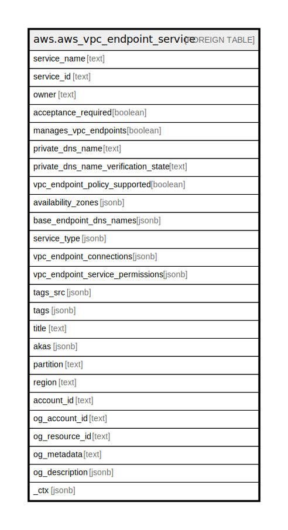

# aws.aws_vpc_endpoint_service

## Description

AWS VPC Endpoint Service

## Columns

| Name | Type | Default | Nullable | Children | Parents | Comment |
| ---- | ---- | ------- | -------- | -------- | ------- | ------- |
| service_name | text |  | true |  |  | The Amazon Resource Name (ARN) of the service. |
| service_id | text |  | true |  |  | The ID of the endpoint service. |
| owner | text |  | true |  |  | The AWS account ID of the service owner. |
| acceptance_required | boolean |  | true |  |  | Indicates whether VPC endpoint connection requests to the service must be accepted by the service owner. |
| manages_vpc_endpoints | boolean |  | true |  |  | Indicates whether the service manages its VPC endpoints. Management of the service VPC endpoints using the VPC endpoint API is restricted. |
| private_dns_name | text |  | true |  |  | The private DNS name for the service. |
| private_dns_name_verification_state | text |  | true |  |  | The verification state of the VPC endpoint service. Consumers of the endpoint service cannot use the private name when the state is not verified. |
| vpc_endpoint_policy_supported | boolean |  | true |  |  | Indicates whether the service supports endpoint policies. |
| availability_zones | jsonb |  | true |  |  | The Availability Zones in which the service is available. |
| base_endpoint_dns_names | jsonb |  | true |  |  | The DNS names for the service. |
| service_type | jsonb |  | true |  |  | The type of service. |
| vpc_endpoint_connections | jsonb |  | true |  |  | Information about one or more VPC endpoint connections. |
| vpc_endpoint_service_permissions | jsonb |  | true |  |  | Information about one or more allowed principals. |
| tags_src | jsonb |  | true |  |  | A list of tags assigned to the service. |
| tags | jsonb |  | true |  |  | A map of tags for the resource. |
| title | text |  | true |  |  | Title of the resource. |
| akas | jsonb |  | true |  |  | Array of globally unique identifier strings (also known as) for the resource. |
| partition | text |  | true |  |  | The AWS partition in which the resource is located (aws, aws-cn, or aws-us-gov). |
| region | text |  | true |  |  | The AWS Region in which the resource is located. |
| account_id | text |  | true |  |  | The AWS Account ID in which the resource is located. |
| og_account_id | text |  | true |  |  | The Platform Account ID in which the resource is located. |
| og_resource_id | text |  | true |  |  | The unique ID of the resource in opengovernance. |
| og_metadata | text |  | true |  |  | Platform Metadata of the AWS resource. |
| og_description | jsonb |  | true |  |  | The full model description of the resource |
| _ctx | jsonb |  | true |  |  | Steampipe context in JSON form, e.g. connection_name. |

## Relations

---

> Generated by [tbls](https://github.com/k1LoW/tbls)
