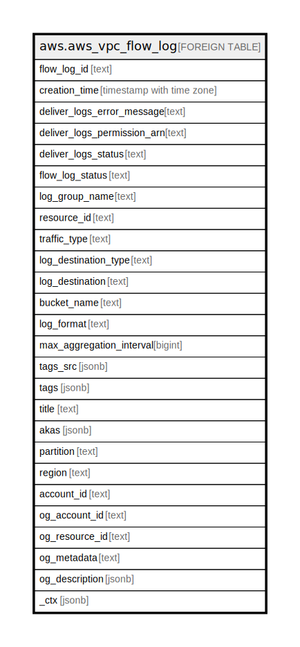

# aws.aws_vpc_flow_log

## Description

AWS VPC Flowlog

## Columns

| Name | Type | Default | Nullable | Children | Parents | Comment |
| ---- | ---- | ------- | -------- | -------- | ------- | ------- |
| flow_log_id | text |  | true |  |  | The ID of the flow log. |
| creation_time | timestamp with time zone |  | true |  |  | The date and time the flow log was created. |
| deliver_logs_error_message | text |  | true |  |  | Information about the error that occurred. |
| deliver_logs_permission_arn | text |  | true |  |  | The ARN of the IAM role that posts logs to CloudWatch Logs. |
| deliver_logs_status | text |  | true |  |  | The status of the logs delivery (SUCCESS | FAILED). |
| flow_log_status | text |  | true |  |  | The status of the flow log (ACTIVE). |
| log_group_name | text |  | true |  |  | The name of the flow log group. |
| resource_id | text |  | true |  |  | The ID of the VPC, subnet, or network interface. |
| traffic_type | text |  | true |  |  | The type of traffic. Valid values are: 'ACCEPT', 'REJECT',  'ALL'. |
| log_destination_type | text |  | true |  |  | Specifies the type of destination to which the flow log data is published. |
| log_destination | text |  | true |  |  | Specifies the destination to which the flow log data is published. |
| bucket_name | text |  | true |  |  | The name of the destination bucket to which the flow log data is published. |
| log_format | text |  | true |  |  | The format of the flow log record. |
| max_aggregation_interval | bigint |  | true |  |  | The maximum interval of time, in seconds, during which a flow of packets is captured and aggregated into a flow log record. |
| tags_src | jsonb |  | true |  |  | A list of tags assigned to the VPC flowlog. |
| tags | jsonb |  | true |  |  | A map of tags for the resource. |
| title | text |  | true |  |  | Title of the resource. |
| akas | jsonb |  | true |  |  | Array of globally unique identifier strings (also known as) for the resource. |
| partition | text |  | true |  |  | The AWS partition in which the resource is located (aws, aws-cn, or aws-us-gov). |
| region | text |  | true |  |  | The AWS Region in which the resource is located. |
| account_id | text |  | true |  |  | The AWS Account ID in which the resource is located. |
| og_account_id | text |  | true |  |  | The Platform Account ID in which the resource is located. |
| og_resource_id | text |  | true |  |  | The unique ID of the resource in opengovernance. |
| og_metadata | text |  | true |  |  | Platform Metadata of the AWS resource. |
| og_description | jsonb |  | true |  |  | The full model description of the resource |
| _ctx | jsonb |  | true |  |  | Steampipe context in JSON form, e.g. connection_name. |

## Relations

---

> Generated by [tbls](https://github.com/k1LoW/tbls)
