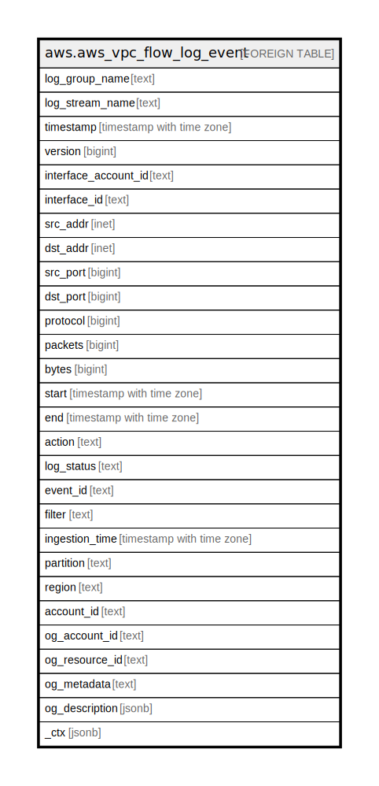

# aws.aws_vpc_flow_log_event

## Description

AWS VPC Flow Log events from CloudWatch Logs

## Columns

| Name | Type | Default | Nullable | Children | Parents | Comment |
| ---- | ---- | ------- | -------- | -------- | ------- | ------- |
| log_group_name | text |  | true |  |  | The name of the log group to which this event belongs. |
| log_stream_name | text |  | true |  |  | The name of the log stream to which this event belongs. |
| timestamp | timestamp with time zone |  | true |  |  | The time when the event occurred. |
| version | bigint |  | true |  |  | The VPC Flow Logs version. If you use the default format, the version is 2. If you use a custom format, the version is the highest version among the specified fields. For example, if you specify only fields from version 2, the version is 2. If you specify a mixture of fields from versions 2, 3, and 4, the version is 4. |
| interface_account_id | text |  | true |  |  | The AWS account ID of the owner of the source network interface for which traffic is recorded. If the network interface is created by an AWS service, for example when creating a VPC endpoint or Network Load Balancer, the record may display unknown for this field. |
| interface_id | text |  | true |  |  | The ID of the network interface for which the traffic is recorded. |
| src_addr | inet |  | true |  |  | The source address for incoming traffic, or the IPv4 or IPv6 address of the network interface for outgoing traffic on the network interface. The IPv4 address of the network interface is always its private IPv4 address. See also pkt-srcaddr. |
| dst_addr | inet |  | true |  |  | The destination address for outgoing traffic, or the IPv4 or IPv6 address of the network interface for incoming traffic on the network interface. The IPv4 address of the network interface is always its private IPv4 address. See also pkt-dstaddr. |
| src_port | bigint |  | true |  |  | The source port of the traffic. |
| dst_port | bigint |  | true |  |  | The destination port of the traffic. |
| protocol | bigint |  | true |  |  | The IANA protocol number of the traffic. For more information, see Assigned Internet Protocol Numbers. |
| packets | bigint |  | true |  |  | The number of packets transferred during the flow. |
| bytes | bigint |  | true |  |  | The number of bytes transferred during the flow. |
| start | timestamp with time zone |  | true |  |  | The time when the first packet of the flow was received within the aggregation interval. This might be up to 60 seconds after the packet was transmitted or received on the network interface. |
| end | timestamp with time zone |  | true |  |  | The time when the last packet of the flow was received within the aggregation interval. This might be up to 60 seconds after the packet was transmitted or received on the network interface. |
| action | text |  | true |  |  | The action that is associated with the traffic: ACCEPT — The recorded traffic was permitted by the security groups and network ACLs. REJECT — The recorded traffic was not permitted by the security groups or network ACLs. |
| log_status | text |  | true |  |  | The logging status of the flow log: OK — Data is logging normally to the chosen destinations. NODATA — There was no network traffic to or from the network interface during the aggregation interval. SKIPDATA — Some flow log records were skipped during the aggregation interval. This may be because of an internal capacity constraint, or an internal error. |
| event_id | text |  | true |  |  | The ID of the event. |
| filter | text |  | true |  |  | Filter pattern for the search. |
| ingestion_time | timestamp with time zone |  | true |  |  | The time when the event was ingested. |
| partition | text |  | true |  |  | The AWS partition in which the resource is located (aws, aws-cn, or aws-us-gov). |
| region | text |  | true |  |  | The AWS Region in which the resource is located. |
| account_id | text |  | true |  |  | The AWS Account ID in which the resource is located. |
| og_account_id | text |  | true |  |  | The Platform Account ID in which the resource is located. |
| og_resource_id | text |  | true |  |  | The unique ID of the resource in opengovernance. |
| og_metadata | text |  | true |  |  | Platform Metadata of the AWS resource. |
| og_description | jsonb |  | true |  |  | The full model description of the resource |
| _ctx | jsonb |  | true |  |  | Steampipe context in JSON form, e.g. connection_name. |

## Relations

---

> Generated by [tbls](https://github.com/k1LoW/tbls)
