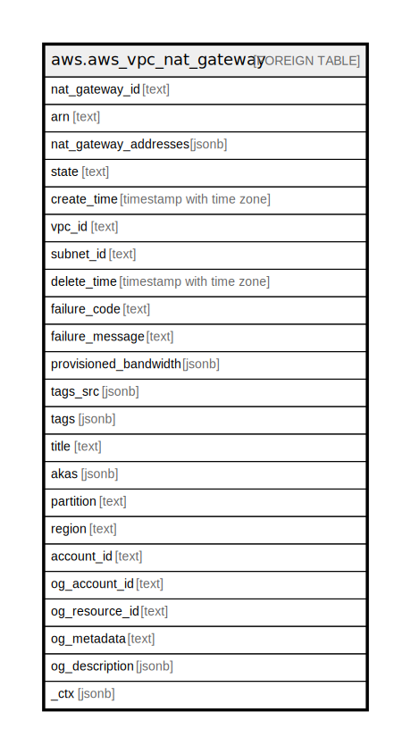

# aws.aws_vpc_nat_gateway

## Description

AWS VPC Network Address Translation Gateway

## Columns

| Name | Type | Default | Nullable | Children | Parents | Comment |
| ---- | ---- | ------- | -------- | -------- | ------- | ------- |
| nat_gateway_id | text |  | true |  |  | The ID of the NAT gateway. |
| arn | text |  | true |  |  | The Amazon Resource Name (ARN) specifying the NAT gateway. |
| nat_gateway_addresses | jsonb |  | true |  |  | Information about the IP addresses and network interface associated with the NAT gateway. |
| state | text |  | true |  |  | The current state of the NAT gateway (pending | failed | available | deleting | deleted). |
| create_time | timestamp with time zone |  | true |  |  | The date and time the NAT gateway was created. |
| vpc_id | text |  | true |  |  | The ID of the VPC in which the NAT gateway is located. |
| subnet_id | text |  | true |  |  | The ID of the subnet in which the NAT gateway is located. |
| delete_time | timestamp with time zone |  | true |  |  | The date and time the NAT gateway was deleted, if applicable. |
| failure_code | text |  | true |  |  | If the NAT gateway could not be created, specifies the error code for the failure. (InsufficientFreeAddressesInSubnet | Gateway.NotAttached | InvalidAllocationID.NotFound | Resource.AlreadyAssociated | InternalError | InvalidSubnetID.NotFound). |
| failure_message | text |  | true |  |  | If the NAT gateway could not be created, specifies the error message for the failure. |
| provisioned_bandwidth | jsonb |  | true |  |  | Reserved. If you need to sustain traffic greater than the documented limits (https://docs.aws.amazon.com/vpc/latest/userguide/vpc-nat-gateway.html). |
| tags_src | jsonb |  | true |  |  | A list of tags that are attached to NAT gateway. |
| tags | jsonb |  | true |  |  | A map of tags for the resource. |
| title | text |  | true |  |  | Title of the resource. |
| akas | jsonb |  | true |  |  | Array of globally unique identifier strings (also known as) for the resource. |
| partition | text |  | true |  |  | The AWS partition in which the resource is located (aws, aws-cn, or aws-us-gov). |
| region | text |  | true |  |  | The AWS Region in which the resource is located. |
| account_id | text |  | true |  |  | The AWS Account ID in which the resource is located. |
| og_account_id | text |  | true |  |  | The Platform Account ID in which the resource is located. |
| og_resource_id | text |  | true |  |  | The unique ID of the resource in opengovernance. |
| og_metadata | text |  | true |  |  | Platform Metadata of the AWS resource. |
| og_description | jsonb |  | true |  |  | The full model description of the resource |
| _ctx | jsonb |  | true |  |  | Steampipe context in JSON form, e.g. connection_name. |

## Relations

---

> Generated by [tbls](https://github.com/k1LoW/tbls)
