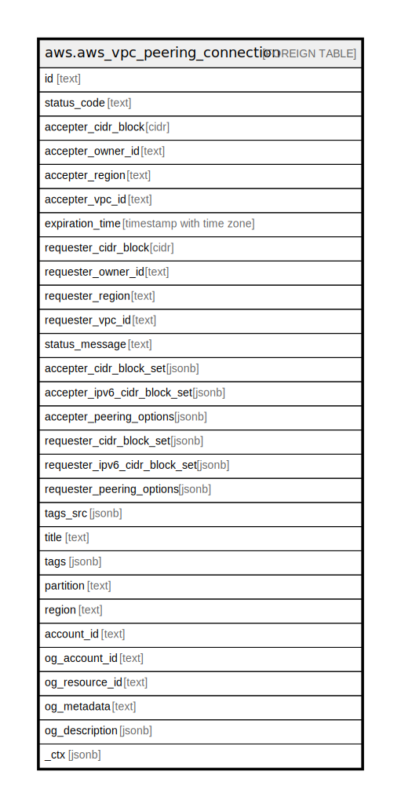

# aws.aws_vpc_peering_connection

## Description

AWS VPC Peering Connection

## Columns

| Name | Type | Default | Nullable | Children | Parents | Comment |
| ---- | ---- | ------- | -------- | -------- | ------- | ------- |
| id | text |  | true |  |  | The ID of the VPC peering connection. |
| status_code | text |  | true |  |  | The status of the VPC peering connection. Possible values include: 'pending-acceptance', 'failed', 'expired', 'provisioning', 'active', 'deleting', 'deleted' or 'rejected'. |
| accepter_cidr_block | cidr |  | true |  |  | The IPv4 CIDR block for the accepter VPC. |
| accepter_owner_id | text |  | true |  |  | The ID of the Amazon Web Services account that owns the accepter VPC. |
| accepter_region | text |  | true |  |  | The Region in which the accepter VPC is located. |
| accepter_vpc_id | text |  | true |  |  | The ID of the accepter VPC. |
| expiration_time | timestamp with time zone |  | true |  |  | The time that an unaccepted VPC peering connection will expire. |
| requester_cidr_block | cidr |  | true |  |  | The IPv4 CIDR block for the requester VPC. |
| requester_owner_id | text |  | true |  |  | The ID of the Amazon Web Services account that owns the requester VPC. |
| requester_region | text |  | true |  |  | The Region in which the requester VPC is located. |
| requester_vpc_id | text |  | true |  |  | The ID of the requester VPC. |
| status_message | text |  | true |  |  | A message that provides more information about the status, if applicable. |
| accepter_cidr_block_set | jsonb |  | true |  |  | Information about the IPv4 CIDR blocks for the accepter VPC. |
| accepter_ipv6_cidr_block_set | jsonb |  | true |  |  | The IPv6 CIDR block for the accepter VPC. |
| accepter_peering_options | jsonb |  | true |  |  | Information about the VPC peering connection options for the accepter VPC. |
| requester_cidr_block_set | jsonb |  | true |  |  | Information about the IPv4 CIDR blocks for the requester VPC. |
| requester_ipv6_cidr_block_set | jsonb |  | true |  |  | The IPv6 CIDR block for the requester VPC. |
| requester_peering_options | jsonb |  | true |  |  | Information about the VPC peering connection options for the requester VPC. |
| tags_src | jsonb |  | true |  |  | The tags assigned to the resource. |
| title | text |  | true |  |  | Title of the resource. |
| tags | jsonb |  | true |  |  | A map of tags for the resource. |
| partition | text |  | true |  |  | The AWS partition in which the resource is located (aws, aws-cn, or aws-us-gov). |
| region | text |  | true |  |  | The AWS Region in which the resource is located. |
| account_id | text |  | true |  |  | The AWS Account ID in which the resource is located. |
| og_account_id | text |  | true |  |  | The Platform Account ID in which the resource is located. |
| og_resource_id | text |  | true |  |  | The unique ID of the resource in opengovernance. |
| og_metadata | text |  | true |  |  | Platform Metadata of the AWS resource. |
| og_description | jsonb |  | true |  |  | The full model description of the resource |
| _ctx | jsonb |  | true |  |  | Steampipe context in JSON form, e.g. connection_name. |

## Relations

---

> Generated by [tbls](https://github.com/k1LoW/tbls)
