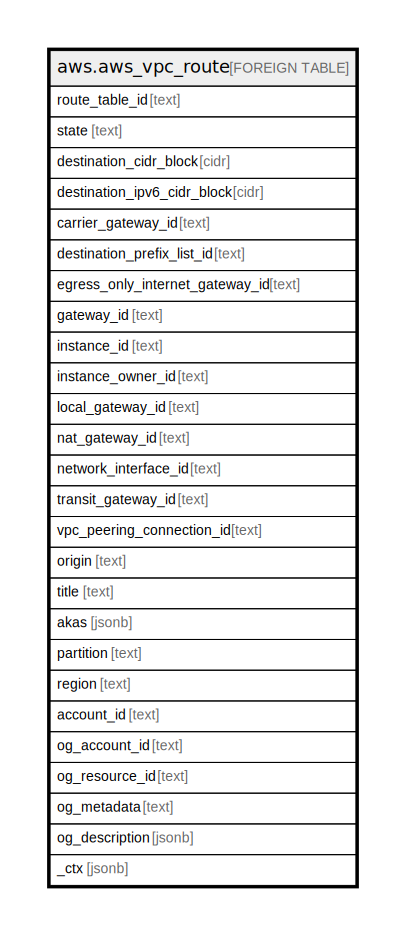

# aws.aws_vpc_route

## Description

AWS VPC Route

## Columns

| Name | Type | Default | Nullable | Children | Parents | Comment |
| ---- | ---- | ------- | -------- | -------- | ------- | ------- |
| route_table_id | text |  | true |  |  | The ID of the route table containing the route. |
| state | text |  | true |  |  | The state of the route. The blackhole state indicates that the route's target isn't available (for example, the specified gateway isn't attached to the VPC, or the specified NAT instance has been terminated). |
| destination_cidr_block | cidr |  | true |  |  | The IPv4 CIDR block used for the destination match. |
| destination_ipv6_cidr_block | cidr |  | true |  |  | The IPv6 CIDR block used for the destination match. |
| carrier_gateway_id | text |  | true |  |  | The ID of the carrier gateway. |
| destination_prefix_list_id | text |  | true |  |  | The prefix of the AWS service. |
| egress_only_internet_gateway_id | text |  | true |  |  | The ID of the egress-only internet gateway. |
| gateway_id | text |  | true |  |  | The ID of a gateway attached to your VPC. |
| instance_id | text |  | true |  |  | The ID of a NAT instance in your VPC. |
| instance_owner_id | text |  | true |  |  | The AWS account ID of the owner of the instance. |
| local_gateway_id | text |  | true |  |  | The ID of the local gateway. |
| nat_gateway_id | text |  | true |  |  | The ID of a NAT gateway. |
| network_interface_id | text |  | true |  |  | The ID of the network interface. |
| transit_gateway_id | text |  | true |  |  | The ID of a transit gateway. |
| vpc_peering_connection_id | text |  | true |  |  | The ID of a VPC peering connection. |
| origin | text |  | true |  |  | Describes how the route was created. CreateRouteTable - The route was automatically created when the route table was created. CreateRoute - The route was manually added to the route table. EnableVgwRoutePropagation - The route was propagated by route propagation. |
| title | text |  | true |  |  | Title of the resource. |
| akas | jsonb |  | true |  |  | Array of globally unique identifier strings (also known as) for the resource. |
| partition | text |  | true |  |  | The AWS partition in which the resource is located (aws, aws-cn, or aws-us-gov). |
| region | text |  | true |  |  | The AWS Region in which the resource is located. |
| account_id | text |  | true |  |  | The AWS Account ID in which the resource is located. |
| og_account_id | text |  | true |  |  | The Platform Account ID in which the resource is located. |
| og_resource_id | text |  | true |  |  | The unique ID of the resource in opengovernance. |
| og_metadata | text |  | true |  |  | Platform Metadata of the AWS resource. |
| og_description | jsonb |  | true |  |  | The full model description of the resource |
| _ctx | jsonb |  | true |  |  | Steampipe context in JSON form, e.g. connection_name. |

## Relations

---

> Generated by [tbls](https://github.com/k1LoW/tbls)
