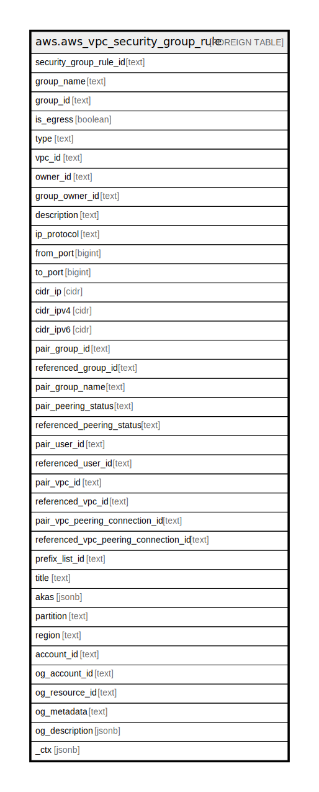

# aws.aws_vpc_security_group_rule

## Description

AWS VPC Security Group Rule

## Columns

| Name | Type | Default | Nullable | Children | Parents | Comment |
| ---- | ---- | ------- | -------- | -------- | ------- | ------- |
| security_group_rule_id | text |  | true |  |  | The ID of the security group rule. |
| group_name | text |  | true |  |  | The name of the security group to which rule belongs. |
| group_id | text |  | true |  |  | The ID of the security group to which rule belongs. |
| is_egress | boolean |  | true |  |  | Indicates whether the security group rule is an outbound rule. |
| type | text |  | true |  |  | Type of the rule ( ingress | egress). |
| vpc_id | text |  | true |  |  | The ID of the VPC for the security group. |
| owner_id | text |  | true |  |  | The AWS account ID of the owner of the security group to which rule belongs. |
| group_owner_id | text |  | true |  |  | The ID of the Amazon Web Services account that owns the security group. |
| description | text |  | true |  |  | The security group rule description. |
| ip_protocol | text |  | true |  |  | The IP protocol name (tcp, udp, icmp, icmpv6) or number [see Protocol Numbers ](http://www.iana.org/assignments/protocol-numbers/protocol-numbers.xhtml). Use -1 to specify all protocols. When authorizing security group rules, specifying -1 or a protocol number other than tcp, udp, icmp, or icmpv6 allows traffic on all ports, regardless of any port range specified. For tcp, udp, and icmp, a port range is specified. For icmpv6, the port range is optional. If port range is omitted, traffic for all types and codes is allowed. |
| from_port | bigint |  | true |  |  | The start of port range for the TCP and UDP protocols, or an ICMP/ICMPv6 type number. A value of -1 indicates all ICMP/ICMPv6 types. |
| to_port | bigint |  | true |  |  | The end of port range for the TCP and UDP protocols, or an ICMP/ICMPv6 code. A value of -1 indicates all ICMP/ICMPv6 codes. |
| cidr_ip | cidr |  | true |  |  | The IPv4 CIDR range. It can be either a CIDR range or a source security group, not both. A single IPv4 address is denoted by /32 prefix length. |
| cidr_ipv4 | cidr |  | true |  |  | The IPv4 CIDR range. |
| cidr_ipv6 | cidr |  | true |  |  | The IPv6 CIDR range. It can be either a CIDR range or a source security group, not both. A single IPv6 address is denoted by /128 prefix length. |
| pair_group_id | text |  | true |  |  | The ID of the security group that references this user ID group pair. |
| referenced_group_id | text |  | true |  |  | The ID of the referenced security group. |
| pair_group_name | text |  | true |  |  | The name of the security group that references this user ID group pair. |
| pair_peering_status | text |  | true |  |  | The status of a VPC peering connection, if applicable. |
| referenced_peering_status | text |  | true |  |  | The status of a VPC peering connection, if applicable. |
| pair_user_id | text |  | true |  |  | The ID of an AWS account. For a referenced security group in another VPC, the account ID of the referenced security group is returned in the response. If the referenced security group is deleted, this value is not returned. |
| referenced_user_id | text |  | true |  |  | The ID of an AWS account. For a referenced security group in another VPC, the account ID of the referenced security group is returned in the response. If the referenced security group is deleted, this value is not returned. |
| pair_vpc_id | text |  | true |  |  | The ID of the VPC for the referenced security group, if applicable. |
| referenced_vpc_id | text |  | true |  |  | The ID of the VPC for the referenced security group, if applicable. |
| pair_vpc_peering_connection_id | text |  | true |  |  | The ID of the VPC peering connection, if applicable. |
| referenced_vpc_peering_connection_id | text |  | true |  |  | The ID of the VPC peering connection, if applicable. |
| prefix_list_id | text |  | true |  |  | The ID of the referenced prefix list. |
| title | text |  | true |  |  | Title of the resource. |
| akas | jsonb |  | true |  |  | Array of globally unique identifier strings (also known as) for the resource. |
| partition | text |  | true |  |  | The AWS partition in which the resource is located (aws, aws-cn, or aws-us-gov). |
| region | text |  | true |  |  | The AWS Region in which the resource is located. |
| account_id | text |  | true |  |  | The AWS Account ID in which the resource is located. |
| og_account_id | text |  | true |  |  | The Platform Account ID in which the resource is located. |
| og_resource_id | text |  | true |  |  | The unique ID of the resource in opengovernance. |
| og_metadata | text |  | true |  |  | Platform Metadata of the AWS resource. |
| og_description | jsonb |  | true |  |  | The full model description of the resource |
| _ctx | jsonb |  | true |  |  | Steampipe context in JSON form, e.g. connection_name. |

## Relations

---

> Generated by [tbls](https://github.com/k1LoW/tbls)
