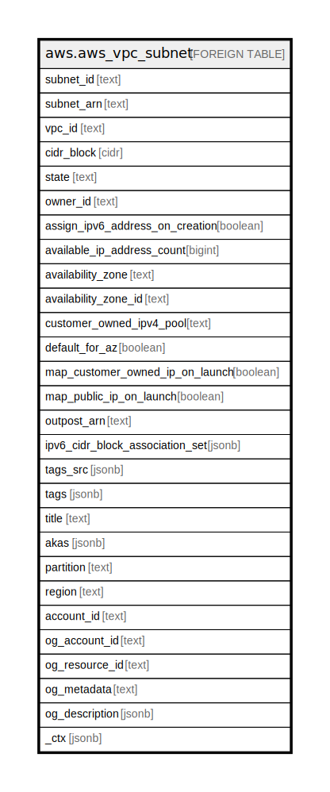

# aws.aws_vpc_subnet

## Description

AWS VPC Subnet

## Columns

| Name | Type | Default | Nullable | Children | Parents | Comment |
| ---- | ---- | ------- | -------- | -------- | ------- | ------- |
| subnet_id | text |  | true |  |  | Contains the unique ID to specify a subnet. |
| subnet_arn | text |  | true |  |  | Contains the Amazon Resource Name (ARN) of the subnet. |
| vpc_id | text |  | true |  |  | ID of the VPC, the subnet is in. |
| cidr_block | cidr |  | true |  |  | Contains the IPv4 CIDR block assigned to the subnet. |
| state | text |  | true |  |  | Current state of the subnet. |
| owner_id | text |  | true |  |  | Contains the AWS account that own the subnet. |
| assign_ipv6_address_on_creation | boolean |  | true |  |  | Indicates whether a network interface created in this subnet (including a network interface created by RunInstances) receives an IPv6 address. |
| available_ip_address_count | bigint |  | true |  |  | The number of unused private IPv4 addresses in the subnet. The IPv4 addresses for any stopped instances are considered unavailable. |
| availability_zone | text |  | true |  |  | The Availability Zone of the subnet. |
| availability_zone_id | text |  | true |  |  | The AZ ID of the subnet. |
| customer_owned_ipv4_pool | text |  | true |  |  | The customer-owned IPv4 address pool associated with the subnet. |
| default_for_az | boolean |  | true |  |  | Indicates whether this is the default subnet for the Availability Zone. |
| map_customer_owned_ip_on_launch | boolean |  | true |  |  | Indicates whether a network interface created in this subnet (including a network interface created by RunInstances) receives a customer-owned IPv4 address. |
| map_public_ip_on_launch | boolean |  | true |  |  | Indicates whether instances launched in this subnet receive a public IPv4 address. |
| outpost_arn | text |  | true |  |  | The Amazon Resource Name (ARN) of the Outpost. Available only if subnet is on an outpost. |
| ipv6_cidr_block_association_set | jsonb |  | true |  |  | A list of IPv6 CIDR blocks associated with the subnet. |
| tags_src | jsonb |  | true |  |  | A list of tags that are attached to the subnet. |
| tags | jsonb |  | true |  |  | A map of tags for the resource. |
| title | text |  | true |  |  | Title of the resource. |
| akas | jsonb |  | true |  |  | Array of globally unique identifier strings (also known as) for the resource. |
| partition | text |  | true |  |  | The AWS partition in which the resource is located (aws, aws-cn, or aws-us-gov). |
| region | text |  | true |  |  | The AWS Region in which the resource is located. |
| account_id | text |  | true |  |  | The AWS Account ID in which the resource is located. |
| og_account_id | text |  | true |  |  | The Platform Account ID in which the resource is located. |
| og_resource_id | text |  | true |  |  | The unique ID of the resource in opengovernance. |
| og_metadata | text |  | true |  |  | Platform Metadata of the AWS resource. |
| og_description | jsonb |  | true |  |  | The full model description of the resource |
| _ctx | jsonb |  | true |  |  | Steampipe context in JSON form, e.g. connection_name. |

## Relations

---

> Generated by [tbls](https://github.com/k1LoW/tbls)
