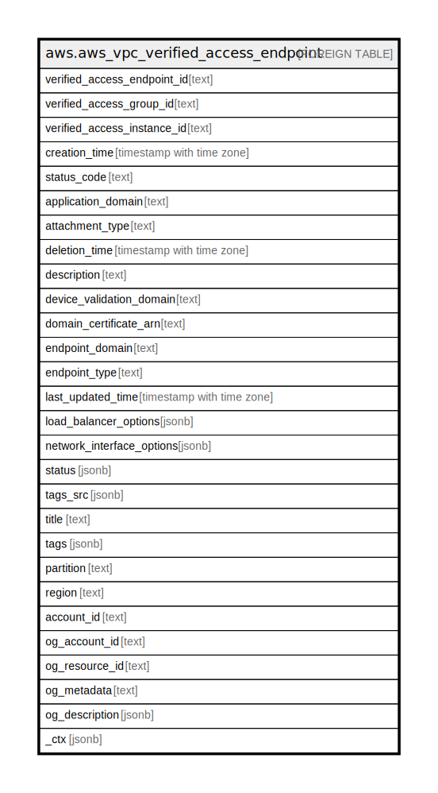

# aws.aws_vpc_verified_access_endpoint

## Description

AWS VPC verified access Endpoint

## Columns

| Name | Type | Default | Nullable | Children | Parents | Comment |
| ---- | ---- | ------- | -------- | -------- | ------- | ------- |
| verified_access_endpoint_id | text |  | true |  |  | The ID of the AWS verified access endpoint. |
| verified_access_group_id | text |  | true |  |  | The ID of the AWS verified access group. |
| verified_access_instance_id | text |  | true |  |  | The ID of the AWS verified access instance. |
| creation_time | timestamp with time zone |  | true |  |  | The creation time. |
| status_code | text |  | true |  |  | The endpoint status code. Possible values are pending, active, updating, deleting or deleted. |
| application_domain | text |  | true |  |  | The DNS name for users to reach your application. |
| attachment_type | text |  | true |  |  | The type of attachment used to provide connectivity between the AWS verified access endpoint and the application. |
| deletion_time | timestamp with time zone |  | true |  |  | The deletion time. |
| description | text |  | true |  |  | A description for the AWS verified access endpoint. |
| device_validation_domain | text |  | true |  |  | Returned if endpoint has a device trust provider attached. |
| domain_certificate_arn | text |  | true |  |  | The ARN of a public TLS/SSL certificate imported into or created with ACM. |
| endpoint_domain | text |  | true |  |  | A DNS name that is generated for the endpoint.. |
| endpoint_type | text |  | true |  |  | The type of AWS verified access endpoint. Incoming application requests will be sent to an IP address, load balancer or a network interface depending on the endpoint type specified. Possible values are load-balancer or network-interface. |
| last_updated_time | timestamp with time zone |  | true |  |  | The last updated time. |
| load_balancer_options | jsonb |  | true |  |  | The load balancer details if creating the AWS verified access endpoint as load-balancertype. |
| network_interface_options | jsonb |  | true |  |  | The options for network-interface type endpoint. |
| status | jsonb |  | true |  |  | The endpoint status. |
| tags_src | jsonb |  | true |  |  | A map of tags for the resource. |
| title | text |  | true |  |  | Title of the resource. |
| tags | jsonb |  | true |  |  | A map of tags for the resource. |
| partition | text |  | true |  |  | The AWS partition in which the resource is located (aws, aws-cn, or aws-us-gov). |
| region | text |  | true |  |  | The AWS Region in which the resource is located. |
| account_id | text |  | true |  |  | The AWS Account ID in which the resource is located. |
| og_account_id | text |  | true |  |  | The Platform Account ID in which the resource is located. |
| og_resource_id | text |  | true |  |  | The unique ID of the resource in opengovernance. |
| og_metadata | text |  | true |  |  | Platform Metadata of the AWS resource. |
| og_description | jsonb |  | true |  |  | The full model description of the resource |
| _ctx | jsonb |  | true |  |  | Steampipe context in JSON form, e.g. connection_name. |

## Relations

---

> Generated by [tbls](https://github.com/k1LoW/tbls)
