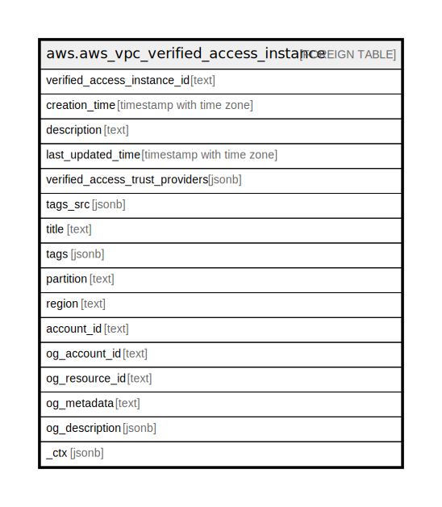

# aws.aws_vpc_verified_access_instance

## Description

AWS VPC Verified Access Instance

## Columns

| Name | Type | Default | Nullable | Children | Parents | Comment |
| ---- | ---- | ------- | -------- | -------- | ------- | ------- |
| verified_access_instance_id | text |  | true |  |  | The ID of the AWS Verified Access instance. |
| creation_time | timestamp with time zone |  | true |  |  | The creation time. |
| description | text |  | true |  |  | A description for the AWS Verified Access instance. |
| last_updated_time | timestamp with time zone |  | true |  |  | The last updated time. |
| verified_access_trust_providers | jsonb |  | true |  |  | The IDs of the AWS Verified Access trusted providers. |
| tags_src | jsonb |  | true |  |  | A map of tags for the resource. |
| title | text |  | true |  |  | Title of the resource. |
| tags | jsonb |  | true |  |  | A map of tags for the resource. |
| partition | text |  | true |  |  | The AWS partition in which the resource is located (aws, aws-cn, or aws-us-gov). |
| region | text |  | true |  |  | The AWS Region in which the resource is located. |
| account_id | text |  | true |  |  | The AWS Account ID in which the resource is located. |
| og_account_id | text |  | true |  |  | The Platform Account ID in which the resource is located. |
| og_resource_id | text |  | true |  |  | The unique ID of the resource in opengovernance. |
| og_metadata | text |  | true |  |  | Platform Metadata of the AWS resource. |
| og_description | jsonb |  | true |  |  | The full model description of the resource |
| _ctx | jsonb |  | true |  |  | Steampipe context in JSON form, e.g. connection_name. |

## Relations

---

> Generated by [tbls](https://github.com/k1LoW/tbls)
