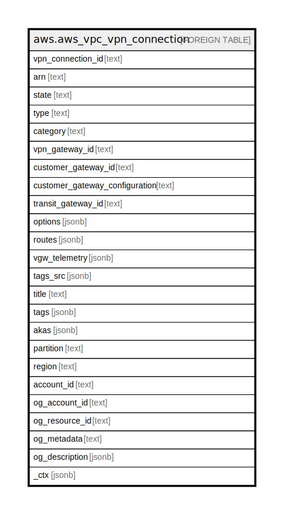

# aws.aws_vpc_vpn_connection

## Description

AWS VPC VPN Connection

## Columns

| Name | Type | Default | Nullable | Children | Parents | Comment |
| ---- | ---- | ------- | -------- | -------- | ------- | ------- |
| vpn_connection_id | text |  | true |  |  | The ID of the VPN connection. |
| arn | text |  | true |  |  | The Amazon Resource Name (ARN) specifying the VPN connection. |
| state | text |  | true |  |  | The current state of the VPN connection. |
| type | text |  | true |  |  | The type of VPN connection. |
| category | text |  | true |  |  | The category of the VPN connection. A value of VPN indicates an AWS VPN connection. |
| vpn_gateway_id | text |  | true |  |  | The ID of the virtual private gateway at the AWS side of the VPN connection. |
| customer_gateway_id | text |  | true |  |  | The ID of the customer gateway at your end of the VPN connection. |
| customer_gateway_configuration | text |  | true |  |  | The configuration information for the VPN connection's customer gateway. |
| transit_gateway_id | text |  | true |  |  | The ID of the transit gateway associated with the VPN connection. |
| options | jsonb |  | true |  |  | The VPN connection options. |
| routes | jsonb |  | true |  |  | The static routes associated with the VPN connection. |
| vgw_telemetry | jsonb |  | true |  |  | Information about the VPN tunnel. |
| tags_src | jsonb |  | true |  |  | A list of tags that are attached to VPN gateway. |
| title | text |  | true |  |  | Title of the resource. |
| tags | jsonb |  | true |  |  | A map of tags for the resource. |
| akas | jsonb |  | true |  |  | Array of globally unique identifier strings (also known as) for the resource. |
| partition | text |  | true |  |  | The AWS partition in which the resource is located (aws, aws-cn, or aws-us-gov). |
| region | text |  | true |  |  | The AWS Region in which the resource is located. |
| account_id | text |  | true |  |  | The AWS Account ID in which the resource is located. |
| og_account_id | text |  | true |  |  | The Platform Account ID in which the resource is located. |
| og_resource_id | text |  | true |  |  | The unique ID of the resource in opengovernance. |
| og_metadata | text |  | true |  |  | Platform Metadata of the AWS resource. |
| og_description | jsonb |  | true |  |  | The full model description of the resource |
| _ctx | jsonb |  | true |  |  | Steampipe context in JSON form, e.g. connection_name. |

## Relations

---

> Generated by [tbls](https://github.com/k1LoW/tbls)
