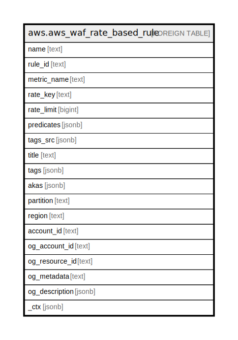

# aws.aws_waf_rate_based_rule

## Description

AWS WAF Rate Based Rule

## Columns

| Name | Type | Default | Nullable | Children | Parents | Comment |
| ---- | ---- | ------- | -------- | -------- | ------- | ------- |
| name | text |  | true |  |  | The name for the rule. |
| rule_id | text |  | true |  |  | The ID of the Rule. |
| metric_name | text |  | true |  |  | The name or description for the metrics for a RateBasedRule. |
| rate_key | text |  | true |  |  | The field that AWS WAF uses to determine if requests are likely arriving from single source and thus subject to rate monitoring. |
| rate_limit | bigint |  | true |  |  | The maximum number of requests, which have an identical value in the field specified by the RateKey, allowed in a five-minute period. |
| predicates | jsonb |  | true |  |  | The Predicates object contains one Predicate element for each ByteMatchSet, IPSet or SqlInjectionMatchSet object that you want to include in a RateBasedRule. |
| tags_src | jsonb |  | true |  |  | A list of tags assigned to the Rule. |
| title | text |  | true |  |  | Title of the resource. |
| tags | jsonb |  | true |  |  | A map of tags for the resource. |
| akas | jsonb |  | true |  |  | Array of globally unique identifier strings (also known as) for the resource. |
| partition | text |  | true |  |  | The AWS partition in which the resource is located (aws, aws-cn, or aws-us-gov). |
| region | text |  | true |  |  | The AWS Region in which the resource is located. |
| account_id | text |  | true |  |  | The AWS Account ID in which the resource is located. |
| og_account_id | text |  | true |  |  | The Platform Account ID in which the resource is located. |
| og_resource_id | text |  | true |  |  | The unique ID of the resource in opengovernance. |
| og_metadata | text |  | true |  |  | Platform Metadata of the AWS resource. |
| og_description | jsonb |  | true |  |  | The full model description of the resource |
| _ctx | jsonb |  | true |  |  | Steampipe context in JSON form, e.g. connection_name. |

## Relations

---

> Generated by [tbls](https://github.com/k1LoW/tbls)
