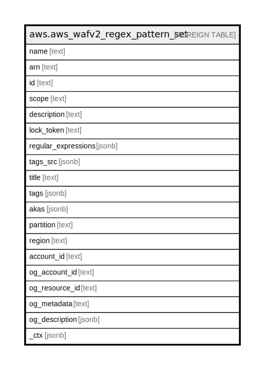

# aws.aws_wafv2_regex_pattern_set

## Description

AWS WAFv2 Regex Pattern Set

## Columns

| Name | Type | Default | Nullable | Children | Parents | Comment |
| ---- | ---- | ------- | -------- | -------- | ------- | ------- |
| name | text |  | true |  |  | The name of the Regex Pattern set. |
| arn | text |  | true |  |  | The Amazon Resource Name (ARN) of the entity. |
| id | text |  | true |  |  | A unique identifier for the Regex Pattern set. |
| scope | text |  | true |  |  | Specifies the scope of the Regex Pattern Set. Possible values are: 'REGIONAL' and 'CLOUDFRONT'. |
| description | text |  | true |  |  | A description of the Regex Pattern set that helps with identification. |
| lock_token | text |  | true |  |  | A token used for optimistic locking. |
| regular_expressions | jsonb |  | true |  |  | The list of regular expression patterns in the set. |
| tags_src | jsonb |  | true |  |  | A list of tags associated with the resource. |
| title | text |  | true |  |  | Title of the resource. |
| tags | jsonb |  | true |  |  | A map of tags for the resource. |
| akas | jsonb |  | true |  |  | Array of globally unique identifier strings (also known as) for the resource. |
| partition | text |  | true |  |  | The AWS partition in which the resource is located (aws, aws-cn, or aws-us-gov). |
| region | text |  | true |  |  | The AWS Region in which the resource is located. |
| account_id | text |  | true |  |  | The AWS Account ID in which the resource is located. |
| og_account_id | text |  | true |  |  | The Platform Account ID in which the resource is located. |
| og_resource_id | text |  | true |  |  | The unique ID of the resource in opengovernance. |
| og_metadata | text |  | true |  |  | Platform Metadata of the AWS resource. |
| og_description | jsonb |  | true |  |  | The full model description of the resource |
| _ctx | jsonb |  | true |  |  | Steampipe context in JSON form, e.g. connection_name. |

## Relations

---

> Generated by [tbls](https://github.com/k1LoW/tbls)
