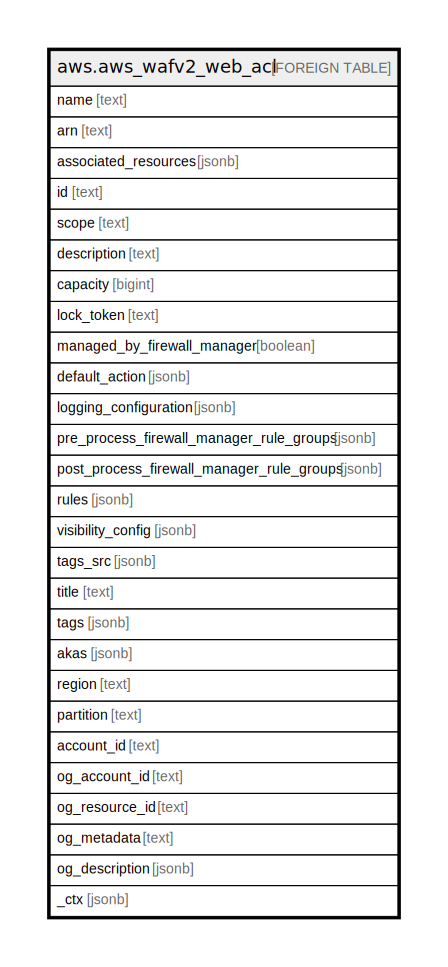

# aws.aws_wafv2_web_acl

## Description

AWS WAFv2 Web ACL

## Columns

| Name | Type | Default | Nullable | Children | Parents | Comment |
| ---- | ---- | ------- | -------- | -------- | ------- | ------- |
| name | text |  | true |  |  | The name of the Web ACL. You cannot change the name of a Web ACL after you create it. |
| arn | text |  | true |  |  | The Amazon Resource Name (ARN) of the entity. |
| associated_resources | jsonb |  | true |  |  | The array of Amazon Resource Names (ARNs) of the associated resources. |
| id | text |  | true |  |  | The unique identifier for the Web ACL. |
| scope | text |  | true |  |  | Specifies the scope of the Web ACL. Possibles values are: 'REGIONAL' and 'CLOUDFRONT'. |
| description | text |  | true |  |  | A description of the Web ACL that helps with identification. |
| capacity | bigint |  | true |  |  | The Web ACL capacity units(WCUs) currently being used by this resource. |
| lock_token | text |  | true |  |  | A token used for optimistic locking. |
| managed_by_firewall_manager | boolean |  | true |  |  | Indicates whether this web ACL is managed by AWS Firewall Manager. |
| default_action | jsonb |  | true |  |  | The action to perform if none of the Rules contained in the Web ACL match. |
| logging_configuration | jsonb |  | true |  |  | The logging configuration for the specified web ACL. |
| pre_process_firewall_manager_rule_groups | jsonb |  | true |  |  | The first set of rules for AWS WAF to process in the web ACL. |
| post_process_firewall_manager_rule_groups | jsonb |  | true |  |  | The last set of rules for AWS WAF to process in the web ACL. |
| rules | jsonb |  | true |  |  | The Rule statements used to identify the web requests that you want to allow, block, or count. |
| visibility_config | jsonb |  | true |  |  | Defines and enables Amazon CloudWatch metrics and web request sample collection. |
| tags_src | jsonb |  | true |  |  | A list of tags associated with the resource. |
| title | text |  | true |  |  | Title of the resource. |
| tags | jsonb |  | true |  |  | A map of tags for the resource. |
| akas | jsonb |  | true |  |  | Array of globally unique identifier strings (also known as) for the resource. |
| region | text |  | true |  |  | The AWS Region in which the resource is located. |
| partition | text |  | true |  |  | The AWS partition in which the resource is located (aws, aws-cn, or aws-us-gov). |
| account_id | text |  | true |  |  | The AWS Account ID in which the resource is located. |
| og_account_id | text |  | true |  |  | The Platform Account ID in which the resource is located. |
| og_resource_id | text |  | true |  |  | The unique ID of the resource in opengovernance. |
| og_metadata | text |  | true |  |  | Platform Metadata of the AWS resource. |
| og_description | jsonb |  | true |  |  | The full model description of the resource |
| _ctx | jsonb |  | true |  |  | Steampipe context in JSON form, e.g. connection_name. |

## Relations

---

> Generated by [tbls](https://github.com/k1LoW/tbls)
