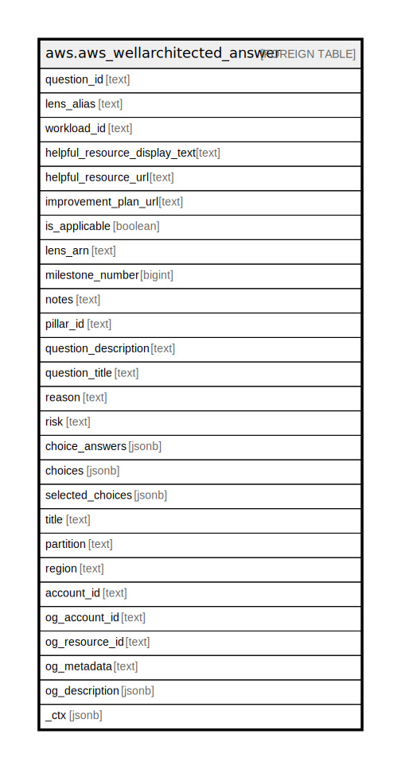

# aws.aws_wellarchitected_answer

## Description

AWS Well-Architected Answer

## Columns

| Name | Type | Default | Nullable | Children | Parents | Comment |
| ---- | ---- | ------- | -------- | -------- | ------- | ------- |
| question_id | text |  | true |  |  | The ID of the question. |
| lens_alias | text |  | true |  |  | The alias of the lens. |
| workload_id | text |  | true |  |  | The ID assigned to the workload. |
| helpful_resource_display_text | text |  | true |  |  | The helpful resource text to be displayed. |
| helpful_resource_url | text |  | true |  |  | The helpful resource URL for a question. |
| improvement_plan_url | text |  | true |  |  | The improvement plan URL for a question. This value is only available if the question has been answered. |
| is_applicable | boolean |  | true |  |  | Defines whether this question is applicable to a lens review. |
| lens_arn | text |  | true |  |  | The Amazon Resource Name (ARN) of the lens. |
| milestone_number | bigint |  | true |  |  | The milestone number. |
| notes | text |  | true |  |  | The notes associated with the workload. |
| pillar_id | text |  | true |  |  | The ID used to identify a pillar, for example, security. A pillar is identified by its PillarReviewSummary$PillarId. |
| question_description | text |  | true |  |  | The description of the question. |
| question_title | text |  | true |  |  | The title of the question. |
| reason | text |  | true |  |  | The reason why the question is not applicable to your workload. |
| risk | text |  | true |  |  | The risk for a given workload, lens review, pillar, or question. |
| choice_answers | jsonb |  | true |  |  | A list of selected choices to a question in your workload. |
| choices | jsonb |  | true |  |  | List of choices available for a question. |
| selected_choices | jsonb |  | true |  |  | List of selected choice IDs in a question answer. The values entered replace the previously selected choices. |
| title | text |  | true |  |  | Title of the resource. |
| partition | text |  | true |  |  | The AWS partition in which the resource is located (aws, aws-cn, or aws-us-gov). |
| region | text |  | true |  |  | The AWS Region in which the resource is located. |
| account_id | text |  | true |  |  | The AWS Account ID in which the resource is located. |
| og_account_id | text |  | true |  |  | The Platform Account ID in which the resource is located. |
| og_resource_id | text |  | true |  |  | The unique ID of the resource in opengovernance. |
| og_metadata | text |  | true |  |  | Platform Metadata of the AWS resource. |
| og_description | jsonb |  | true |  |  | The full model description of the resource |
| _ctx | jsonb |  | true |  |  | Steampipe context in JSON form, e.g. connection_name. |

## Relations

---

> Generated by [tbls](https://github.com/k1LoW/tbls)
