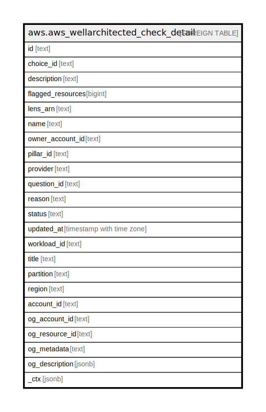

# aws.aws_wellarchitected_check_detail

## Description

AWS Well-Architected Check Detail

## Columns

| Name | Type | Default | Nullable | Children | Parents | Comment |
| ---- | ---- | ------- | -------- | -------- | ------- | ------- |
| id | text |  | true |  |  | Trusted Advisor check ID. |
| choice_id | text |  | true |  |  | The ID of a choice. |
| description | text |  | true |  |  | Trusted Advisor check description. |
| flagged_resources | bigint |  | true |  |  | Count of flagged resources associated to the check. |
| lens_arn | text |  | true |  |  | Well-Architected Lens ARN associated to the check. |
| name | text |  | true |  |  | Trusted Advisor check name. |
| owner_account_id | text |  | true |  |  | An Amazon Web Services account ID. |
| pillar_id | text |  | true |  |  | The ID used to identify a pillar, for example, security. A pillar is identified by its PillarReviewSummary$PillarId. |
| provider | text |  | true |  |  | Provider of the check related to the best practice. |
| question_id | text |  | true |  |  | The ID of the question. |
| reason | text |  | true |  |  | Reason associated to the check. |
| status | text |  | true |  |  | Status associated to the check. |
| updated_at | timestamp with time zone |  | true |  |  | The date and time recorded. |
| workload_id | text |  | true |  |  | The ID of the workload. |
| title | text |  | true |  |  | Title of the resource. |
| partition | text |  | true |  |  | The AWS partition in which the resource is located (aws, aws-cn, or aws-us-gov). |
| region | text |  | true |  |  | The AWS Region in which the resource is located. |
| account_id | text |  | true |  |  | The AWS Account ID in which the resource is located. |
| og_account_id | text |  | true |  |  | The Platform Account ID in which the resource is located. |
| og_resource_id | text |  | true |  |  | The unique ID of the resource in opengovernance. |
| og_metadata | text |  | true |  |  | Platform Metadata of the AWS resource. |
| og_description | jsonb |  | true |  |  | The full model description of the resource |
| _ctx | jsonb |  | true |  |  | Steampipe context in JSON form, e.g. connection_name. |

## Relations

---

> Generated by [tbls](https://github.com/k1LoW/tbls)
