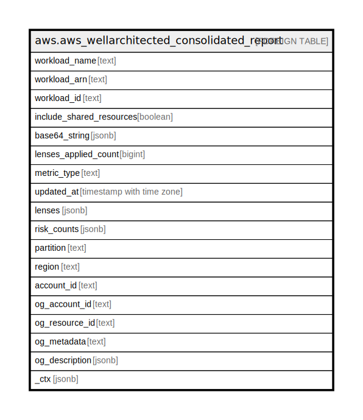

# aws.aws_wellarchitected_consolidated_report

## Description

AWS Well-Architected Consolidated Report

## Columns

| Name | Type | Default | Nullable | Children | Parents | Comment |
| ---- | ---- | ------- | -------- | -------- | ------- | ------- |
| workload_name | text |  | true |  |  | The name of the workload. |
| workload_arn | text |  | true |  |  | The ARN for the workload. |
| workload_id | text |  | true |  |  | The ID assigned to the workload. |
| include_shared_resources | boolean |  | true |  |  | Set to true to have shared resources included in the report. |
| base64_string | jsonb |  | true |  |  | The Base64-encoded string representation of a lens review report. This data can be used to create a PDF file. Only returned by GetConsolidatedReport when PDF format is requested. |
| lenses_applied_count | bigint |  | true |  |  | The total number of lenses applied to the workload. |
| metric_type | text |  | true |  |  | The metric type of a metric in the consolidated report. Currently only WORKLOAD metric types are supported. |
| updated_at | timestamp with time zone |  | true |  |  | The date and time when the consolidated report was updated. |
| lenses | jsonb |  | true |  |  | The metrics for the lenses in the workload. |
| risk_counts | jsonb |  | true |  |  | A map from risk names to the count of how many questions have that rating. |
| partition | text |  | true |  |  | The AWS partition in which the resource is located (aws, aws-cn, or aws-us-gov). |
| region | text |  | true |  |  | The AWS Region in which the resource is located. |
| account_id | text |  | true |  |  | The AWS Account ID in which the resource is located. |
| og_account_id | text |  | true |  |  | The Platform Account ID in which the resource is located. |
| og_resource_id | text |  | true |  |  | The unique ID of the resource in opengovernance. |
| og_metadata | text |  | true |  |  | Platform Metadata of the AWS resource. |
| og_description | jsonb |  | true |  |  | The full model description of the resource |
| _ctx | jsonb |  | true |  |  | Steampipe context in JSON form, e.g. connection_name. |

## Relations

---

> Generated by [tbls](https://github.com/k1LoW/tbls)
