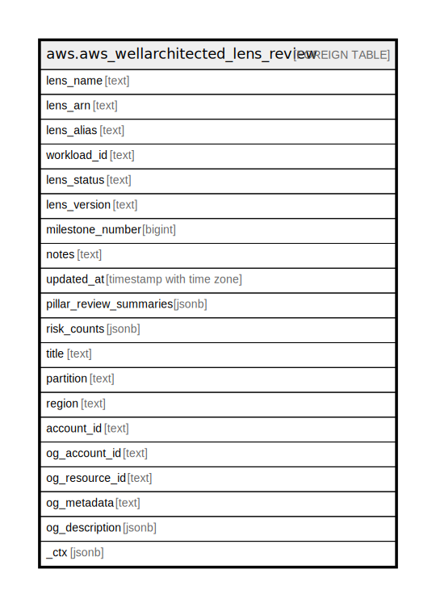

# aws.aws_wellarchitected_lens_review

## Description

AWS Well-Architected Lens Review

## Columns

| Name | Type | Default | Nullable | Children | Parents | Comment |
| ---- | ---- | ------- | -------- | -------- | ------- | ------- |
| lens_name | text |  | true |  |  | The full name of the lens. |
| lens_arn | text |  | true |  |  | The ARN for the lens. |
| lens_alias | text |  | true |  |  | The alias of the lens. |
| workload_id | text |  | true |  |  | The ID assigned to the workload. |
| lens_status | text |  | true |  |  | The status of the lens. |
| lens_version | text |  | true |  |  | The version of the lens. |
| milestone_number | bigint |  | true |  |  | The milestone number. A workload can have a maximum of 100 milestones. |
| notes | text |  | true |  |  | The notes associated with the workload. |
| updated_at | timestamp with time zone |  | true |  |  | The date and time of the last update. |
| pillar_review_summaries | jsonb |  | true |  |  | A map from risk names to the count of how questions have that rating. |
| risk_counts | jsonb |  | true |  |  | A map from risk names to the count of how questions have that rating. |
| title | text |  | true |  |  | Title of the resource. |
| partition | text |  | true |  |  | The AWS partition in which the resource is located (aws, aws-cn, or aws-us-gov). |
| region | text |  | true |  |  | The AWS Region in which the resource is located. |
| account_id | text |  | true |  |  | The AWS Account ID in which the resource is located. |
| og_account_id | text |  | true |  |  | The Platform Account ID in which the resource is located. |
| og_resource_id | text |  | true |  |  | The unique ID of the resource in opengovernance. |
| og_metadata | text |  | true |  |  | Platform Metadata of the AWS resource. |
| og_description | jsonb |  | true |  |  | The full model description of the resource |
| _ctx | jsonb |  | true |  |  | Steampipe context in JSON form, e.g. connection_name. |

## Relations

---

> Generated by [tbls](https://github.com/k1LoW/tbls)
