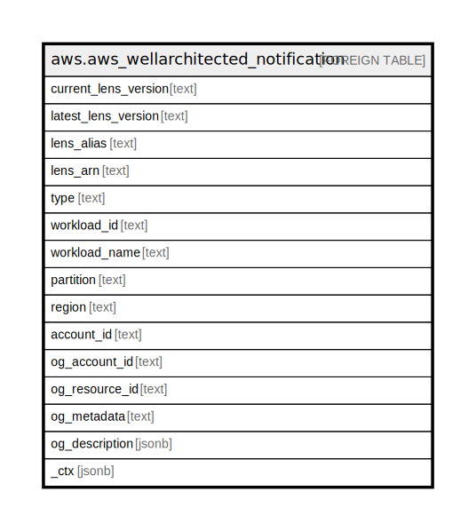

# aws.aws_wellarchitected_notification

## Description

AWS Well-Architected Notification

## Columns

| Name | Type | Default | Nullable | Children | Parents | Comment |
| ---- | ---- | ------- | -------- | -------- | ------- | ------- |
| current_lens_version | text |  | true |  |  | The current version of the lens. |
| latest_lens_version | text |  | true |  |  | The latest version of the lens. |
| lens_alias | text |  | true |  |  | The alias of the lens. |
| lens_arn | text |  | true |  |  | The ARN of the lens. |
| type | text |  | true |  |  | The type of notification. |
| workload_id | text |  | true |  |  | The ID assigned to the workload. |
| workload_name | text |  | true |  |  | The name of the workload. |
| partition | text |  | true |  |  | The AWS partition in which the resource is located (aws, aws-cn, or aws-us-gov). |
| region | text |  | true |  |  | The AWS Region in which the resource is located. |
| account_id | text |  | true |  |  | The AWS Account ID in which the resource is located. |
| og_account_id | text |  | true |  |  | The Platform Account ID in which the resource is located. |
| og_resource_id | text |  | true |  |  | The unique ID of the resource in opengovernance. |
| og_metadata | text |  | true |  |  | Platform Metadata of the AWS resource. |
| og_description | jsonb |  | true |  |  | The full model description of the resource |
| _ctx | jsonb |  | true |  |  | Steampipe context in JSON form, e.g. connection_name. |

## Relations

---

> Generated by [tbls](https://github.com/k1LoW/tbls)
