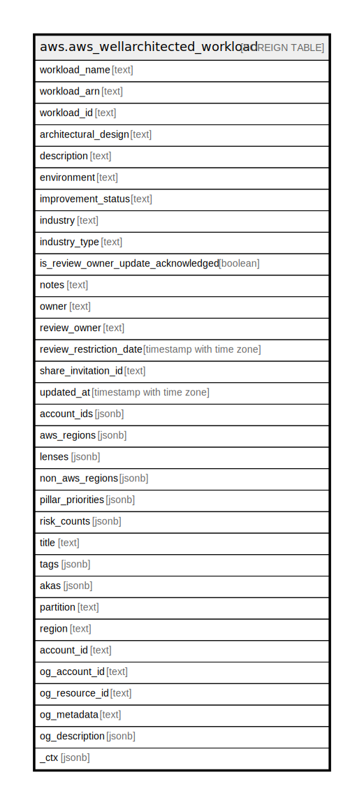

# aws.aws_wellarchitected_workload

## Description

AWS Well-Architected Workload

## Columns

| Name | Type | Default | Nullable | Children | Parents | Comment |
| ---- | ---- | ------- | -------- | -------- | ------- | ------- |
| workload_name | text |  | true |  |  | The name of the workload. |
| workload_arn | text |  | true |  |  | The ARN for the workload. |
| workload_id | text |  | true |  |  | The ID assigned to the workload. |
| architectural_design | text |  | true |  |  | The URL of the architectural design for the workload. |
| description | text |  | true |  |  | The description for the workload. |
| environment | text |  | true |  |  | The environment for the workload. |
| improvement_status | text |  | true |  |  | The improvement status for a workload. |
| industry | text |  | true |  |  | The industry for the workload. |
| industry_type | text |  | true |  |  | The industry type for the workload. |
| is_review_owner_update_acknowledged | boolean |  | true |  |  | Flag indicating whether the workload owner has acknowledged that the review owner field is required. |
| notes | text |  | true |  |  | The notes associated with the workload. |
| owner | text |  | true |  |  | An AWS account ID. |
| review_owner | text |  | true |  |  | The review owner of the workload. |
| review_restriction_date | timestamp with time zone |  | true |  |  | The date and time recorded. |
| share_invitation_id | text |  | true |  |  | The ID assigned to the share invitation. |
| updated_at | timestamp with time zone |  | true |  |  | The date and time recorded. |
| account_ids | jsonb |  | true |  |  | The list of AWS account IDs associated with the workload. |
| aws_regions | jsonb |  | true |  |  | The list of AWS Regions associated with the workload, for example, us-east-2, or ca-central-1. |
| lenses | jsonb |  | true |  |  | The list of lenses associated with the workload. Each lens is identified by its LensSummary$LensAlias. |
| non_aws_regions | jsonb |  | true |  |  | The list of non-AWS Regions associated with the workload. |
| pillar_priorities | jsonb |  | true |  |  | The priorities of the pillars, which are used to order items in the improvement plan.  |
| risk_counts | jsonb |  | true |  |  | A map from risk names to the count of how questions have that rating. |
| title | text |  | true |  |  | Title of the resource. |
| tags | jsonb |  | true |  |  | A map of tags for the resource. |
| akas | jsonb |  | true |  |  | Array of globally unique identifier strings (also known as) for the resource. |
| partition | text |  | true |  |  | The AWS partition in which the resource is located (aws, aws-cn, or aws-us-gov). |
| region | text |  | true |  |  | The AWS Region in which the resource is located. |
| account_id | text |  | true |  |  | The AWS Account ID in which the resource is located. |
| og_account_id | text |  | true |  |  | The Platform Account ID in which the resource is located. |
| og_resource_id | text |  | true |  |  | The unique ID of the resource in opengovernance. |
| og_metadata | text |  | true |  |  | Platform Metadata of the AWS resource. |
| og_description | jsonb |  | true |  |  | The full model description of the resource |
| _ctx | jsonb |  | true |  |  | Steampipe context in JSON form, e.g. connection_name. |

## Relations

---

> Generated by [tbls](https://github.com/k1LoW/tbls)
