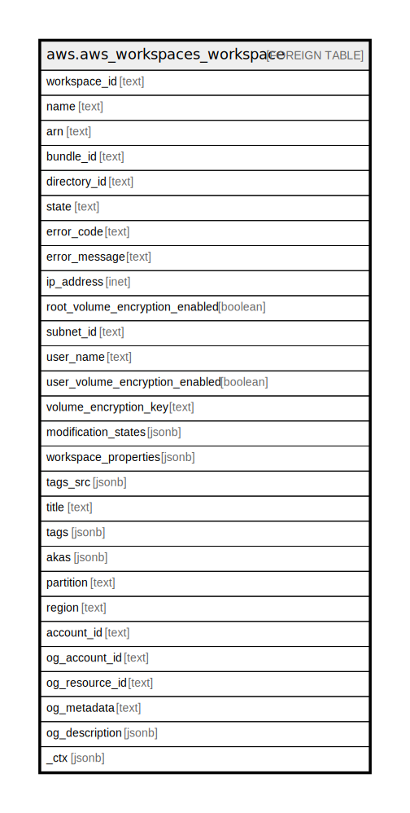

# aws.aws_workspaces_workspace

## Description

AWS Workspaces

## Columns

| Name | Type | Default | Nullable | Children | Parents | Comment |
| ---- | ---- | ------- | -------- | -------- | ------- | ------- |
| workspace_id | text |  | true |  |  | The id of the WorkSpace. |
| name | text |  | true |  |  | The name of the WorkSpace. |
| arn | text |  | true |  |  | The arn of the WorkSpace. |
| bundle_id | text |  | true |  |  | The identifier of the bundle used to create the WorkSpace. |
| directory_id | text |  | true |  |  | The identifier of the AWS Directory Service directory for the WorkSpace. |
| state | text |  | true |  |  | The operational state of the WorkSpace. |
| error_code | text |  | true |  |  | The error code that is returned if the WorkSpace cannot be created. |
| error_message | text |  | true |  |  | The text of the error message that is returned if the WorkSpace cannot be created. |
| ip_address | inet |  | true |  |  | The IP address of the WorkSpace. |
| root_volume_encryption_enabled | boolean |  | true |  |  | Indicates whether the data stored on the root volume is encrypted. |
| subnet_id | text |  | true |  |  | The identifier of the subnet for the WorkSpace. |
| user_name | text |  | true |  |  | The user for the WorkSpace. |
| user_volume_encryption_enabled | boolean |  | true |  |  | Indicates whether the data stored on the user volume is encrypted. |
| volume_encryption_key | text |  | true |  |  | The symmetric AWS KMS customer master key (CMK) used to encrypt data stored on your WorkSpace. Amazon WorkSpaces does not support asymmetric CMKs. |
| modification_states | jsonb |  | true |  |  | The modification states of the WorkSpace. |
| workspace_properties | jsonb |  | true |  |  | The properties of the WorkSpace. |
| tags_src | jsonb |  | true |  |  | The list of tags for the WorkSpace. |
| title | text |  | true |  |  | Title of the resource. |
| tags | jsonb |  | true |  |  | A map of tags for the resource. |
| akas | jsonb |  | true |  |  | Array of globally unique identifier strings (also known as) for the resource. |
| partition | text |  | true |  |  | The AWS partition in which the resource is located (aws, aws-cn, or aws-us-gov). |
| region | text |  | true |  |  | The AWS Region in which the resource is located. |
| account_id | text |  | true |  |  | The AWS Account ID in which the resource is located. |
| og_account_id | text |  | true |  |  | The Platform Account ID in which the resource is located. |
| og_resource_id | text |  | true |  |  | The unique ID of the resource in opengovernance. |
| og_metadata | text |  | true |  |  | Platform Metadata of the AWS resource. |
| og_description | jsonb |  | true |  |  | The full model description of the resource |
| _ctx | jsonb |  | true |  |  | Steampipe context in JSON form, e.g. connection_name. |

## Relations

---

> Generated by [tbls](https://github.com/k1LoW/tbls)
