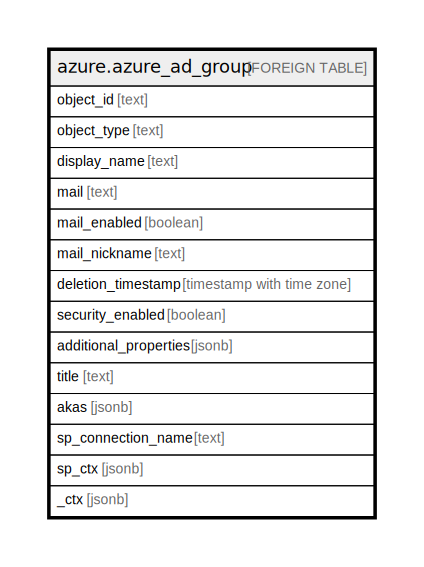

# azure.azure_ad_group

## Description

[DEPRECATED] This table has been deprecated and will be removed in a future release. Please use the azuread_group table in the azuread plugin instead.

## Columns

| Name | Type | Default | Nullable | Children | Parents | Comment |
| ---- | ---- | ------- | -------- | -------- | ------- | ------- |
| object_id | text |  | true |  |  | The unique ID that identifies a group. |
| object_type | text |  | true |  |  | A string that identifies the object type. |
| display_name | text |  | true |  |  | A friendly name that identifies a group. |
| mail | text |  | true |  |  | The primary email address of the group. |
| mail_enabled | boolean |  | true |  |  | Indicates whether the group is mail-enabled. Must be false. This is because only pure security groups can be created using the Graph API. |
| mail_nickname | text |  | true |  |  | The mail alias for the group. |
| deletion_timestamp | timestamp with time zone |  | true |  |  | The time at which the directory object was deleted. |
| security_enabled | boolean |  | true |  |  | Specifies whether the group is a security group. |
| additional_properties | jsonb |  | true |  |  | A list of unmatched properties from the message are deserialized this collection. |
| title | text |  | true |  |  | Title of the resource. |
| akas | jsonb |  | true |  |  | Array of globally unique identifier strings (also known as) for the resource. |
| sp_connection_name | text |  | true |  |  | Steampipe connection name. |
| sp_ctx | jsonb |  | true |  |  | Steampipe context in JSON form. |
| _ctx | jsonb |  | true |  |  | Steampipe context in JSON form. |

## Relations

---

> Generated by [tbls](https://github.com/k1LoW/tbls)
