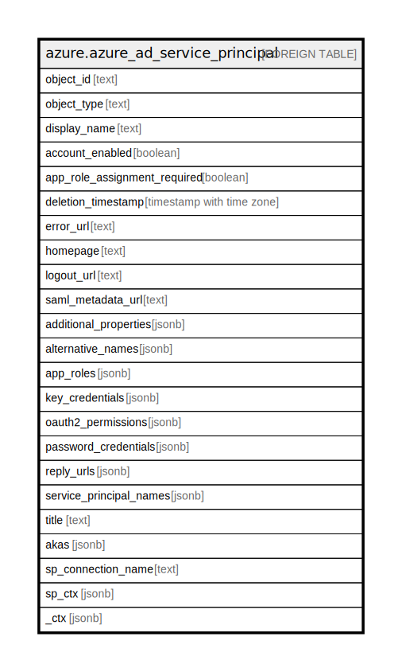

# azure.azure_ad_service_principal

## Description

[DEPRECATED] This table has been deprecated and will be removed in a future release. Please use the azuread_service_principal table in the azuread plugin instead.

## Columns

| Name | Type | Default | Nullable | Children | Parents | Comment |
| ---- | ---- | ------- | -------- | -------- | ------- | ------- |
| object_id | text |  | true |  |  | The unique ID that identifies a service principal. |
| object_type | text |  | true |  |  | A string that identifies the object type. |
| display_name | text |  | true |  |  | A friendly name that identifies a service principal. |
| account_enabled | boolean |  | true |  |  | Indicates whether or not the service principal account is enabled. |
| app_role_assignment_required | boolean |  | true |  |  | Specifies whether an AppRoleAssignment to a user or group is required before Azure AD will issue a user or access token to the application. |
| deletion_timestamp | timestamp with time zone |  | true |  |  | The time at which the directory object was deleted. |
| error_url | text |  | true |  |  | An URL provided by the author of the associated application to report errors when using the application. |
| homepage | text |  | true |  |  | The URL to the homepage of the associated application. |
| logout_url | text |  | true |  |  | An URL provided by the author of the associated application to logout. |
| saml_metadata_url | text |  | true |  |  | The URL to the SAML metadata of the associated application. |
| additional_properties | jsonb |  | true |  |  | A list of unmatched properties from the message are deserialized this collection. |
| alternative_names | jsonb |  | true |  |  | A list of alternative names. |
| app_roles | jsonb |  | true |  |  | A list of application roles that an application may declare. These roles can be assigned to users, groups or service principals. |
| key_credentials | jsonb |  | true |  |  | A list of key credentials associated with the service principal. |
| oauth2_permissions | jsonb |  | true |  |  | The OAuth 2.0 permissions exposed by the associated application. |
| password_credentials | jsonb |  | true |  |  | A list of password credentials associated with the service principal. |
| reply_urls | jsonb |  | true |  |  | The URLs that user tokens are sent to for sign in with the associated application. The redirect URIs that the oAuth 2.0 authorization code and access tokens are sent to for the associated application. |
| service_principal_names | jsonb |  | true |  |  | A list of service principal names. |
| title | text |  | true |  |  | Title of the resource. |
| akas | jsonb |  | true |  |  | Array of globally unique identifier strings (also known as) for the resource. |
| sp_connection_name | text |  | true |  |  | Steampipe connection name. |
| sp_ctx | jsonb |  | true |  |  | Steampipe context in JSON form. |
| _ctx | jsonb |  | true |  |  | Steampipe context in JSON form. |

## Relations

---

> Generated by [tbls](https://github.com/k1LoW/tbls)
