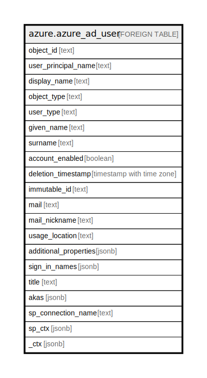

# azure.azure_ad_user

## Description

[DEPRECATED] This table has been deprecated and will be removed in a future release. Please use the azuread_user table in the azuread plugin instead.

## Columns

| Name | Type | Default | Nullable | Children | Parents | Comment |
| ---- | ---- | ------- | -------- | -------- | ------- | ------- |
| object_id | text |  | true |  |  | The unique ID that identifies an active directory user. |
| user_principal_name | text |  | true |  |  | Principal email of the active directory user. |
| display_name | text |  | true |  |  | A friendly name that identifies an active directory user. |
| object_type | text |  | true |  |  | A string that identifies the object type. |
| user_type | text |  | true |  |  | A string value that can be used to classify user types in your directory. |
| given_name | text |  | true |  |  | The given name(first name) of the active directory user. |
| surname | text |  | true |  |  | Family name or last name of the active directory user. |
| account_enabled | boolean |  | true |  |  | Specifies the account status of the active directory user. |
| deletion_timestamp | timestamp with time zone |  | true |  |  |  The time at which the directory object was deleted. |
| immutable_id | text |  | true |  |  | Used to associate an on-premises Active Directory user account with their Azure AD user object. |
| mail | text |  | true |  |  | The SMTP address for the user. |
| mail_nickname | text |  | true |  |  | The mail alias for the user. |
| usage_location | text |  | true |  |  | A two letter country code (ISO standard 3166), required for users that will be assigned licenses due to legal requirement to check for availability of services in countries. |
| additional_properties | jsonb |  | true |  |  | A list of unmatched properties from the message are deserialized this collection. |
| sign_in_names | jsonb |  | true |  |  | A list of sign-in names for a local account in an Azure Active Directory B2C tenant. |
| title | text |  | true |  |  | Title of the resource. |
| akas | jsonb |  | true |  |  | Array of globally unique identifier strings (also known as) for the resource. |
| sp_connection_name | text |  | true |  |  | Steampipe connection name. |
| sp_ctx | jsonb |  | true |  |  | Steampipe context in JSON form. |
| _ctx | jsonb |  | true |  |  | Steampipe context in JSON form. |

## Relations

---

> Generated by [tbls](https://github.com/k1LoW/tbls)
