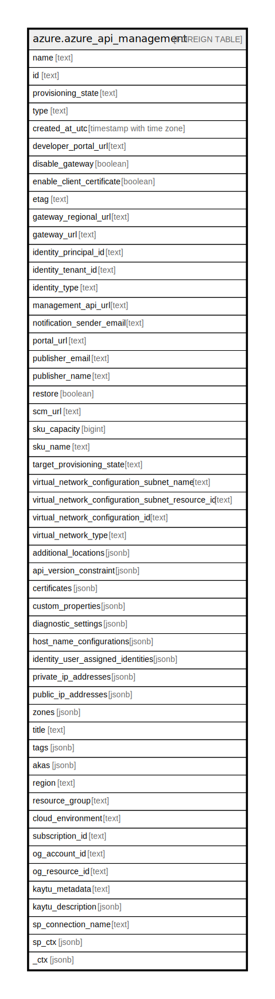

# azure.azure_api_management

## Description

Azure API Management Service

## Columns

| Name | Type | Default | Nullable | Children | Parents | Comment |
| ---- | ---- | ------- | -------- | -------- | ------- | ------- |
| name | text |  | true |  |  | A friendly name that identifies an API management service. |
| id | text |  | true |  |  | Contains ID to identify an API management service uniquely. |
| provisioning_state | text |  | true |  |  | The current provisioning state of the API management service. Possible values include: 'Created', 'Activating', 'Succeeded', 'Updating', 'Failed', 'Stopped', 'Terminating', 'TerminationFailed', 'Deleted'. |
| type | text |  | true |  |  | Type of the resource. |
| created_at_utc | timestamp with time zone |  | true |  |  | Creation UTC date of the API management service. |
| developer_portal_url | text |  | true |  |  | Developer Portal endpoint URL of the API management service. |
| disable_gateway | boolean |  | true |  |  | Property only valid for an API management service deployed in multiple locations. This can be used to disable the gateway in master region. |
| enable_client_certificate | boolean |  | true |  |  | Property only meant to be used for Consumption SKU Service. This enforces a client certificate to be presented on each request to the gateway. This also enables the ability to authenticate the certificate in the policy on the gateway. |
| etag | text |  | true |  |  | An unique read-only string that changes whenever the resource is updated. |
| gateway_regional_url | text |  | true |  |  | Gateway URL of the API management service in the default region. |
| gateway_url | text |  | true |  |  | Gateway URL of the API management service. |
| identity_principal_id | text |  | true |  |  | The principal id of the identity. |
| identity_tenant_id | text |  | true |  |  | The client tenant id of the identity. |
| identity_type | text |  | true |  |  | The type of identity used for the resource. |
| management_api_url | text |  | true |  |  | Management API endpoint URL of the API management service. |
| notification_sender_email | text |  | true |  |  | Email address from which the notification will be sent. |
| portal_url | text |  | true |  |  | Publisher portal endpoint URL of the API management service. |
| publisher_email | text |  | true |  |  | Publisher email of the API management service. |
| publisher_name | text |  | true |  |  | Publisher name of the API management service. |
| restore | boolean |  | true |  |  | Undelete API management service if it was previously soft-deleted. |
| scm_url | text |  | true |  |  | SCM endpoint URL of the API management service. |
| sku_capacity | bigint |  | true |  |  | Capacity of the SKU (number of deployed units of the SKU) |
| sku_name | text |  | true |  |  | Name of the Sku |
| target_provisioning_state | text |  | true |  |  | The provisioning state of the API management service, which is targeted by the long running operation started on the service. |
| virtual_network_configuration_subnet_name | text |  | true |  |  | The name of the subnet. |
| virtual_network_configuration_subnet_resource_id | text |  | true |  |  | The full resource ID of a subnet in a virtual network to deploy the API Management service in. |
| virtual_network_configuration_id | text |  | true |  |  | The virtual network ID. |
| virtual_network_type | text |  | true |  |  | The type of VPN in which API management service needs to be configured in. None (Default Value) means the API management service is not part of any Virtual Network, External means the API management deployment is set up inside a Virtual Network having an Internet Facing Endpoint, and Internal means that API management deployment is setup inside a Virtual Network having an Intranet Facing Endpoint only. Possible values include: 'None', 'External', 'Internal' |
| additional_locations | jsonb |  | true |  |  | Additional datacenter locations of the API management service. |
| api_version_constraint | jsonb |  | true |  |  | Control plane APIs version constraint for the API management service. |
| certificates | jsonb |  | true |  |  | List of certificates that need to be installed in the API management service. |
| custom_properties | jsonb |  | true |  |  | Custom properties of the API management service. |
| diagnostic_settings | jsonb |  | true |  |  | A list of active diagnostic settings for the API management service. |
| host_name_configurations | jsonb |  | true |  |  | Custom hostname configuration of the API management service. |
| identity_user_assigned_identities | jsonb |  | true |  |  | The list of user identities associated with the resource. |
| private_ip_addresses | jsonb |  | true |  |  | Private static load balanced IP addresses of the API management service in primary region which is deployed in an internal virtual network. Available only for 'Basic', 'Standard', 'Premium' and 'Isolated' SKU. |
| public_ip_addresses | jsonb |  | true |  |  | Public static load balanced IP addresses of the API management service in primary region. Available only for 'Basic', 'Standard', 'Premium' and 'Isolated' SKU. |
| zones | jsonb |  | true |  |  | A list of availability zones denoting where the resource needs to come from. |
| title | text |  | true |  |  | Title of the resource. |
| tags | jsonb |  | true |  |  | A map of tags for the resource. |
| akas | jsonb |  | true |  |  | Array of globally unique identifier strings (also known as) for the resource. |
| region | text |  | true |  |  | The Azure region/location in which the resource is located. |
| resource_group | text |  | true |  |  | The resource group which holds this resource. |
| cloud_environment | text |  | true |  |  | The Azure Cloud Environment. |
| subscription_id | text |  | true |  |  | The Azure Subscription ID in which the resource is located. |
| og_account_id | text |  | true |  |  | The Platform Account ID in which the resource is located. |
| og_resource_id | text |  | true |  |  | The unique ID of the resource in opengovernance. |
| kaytu_metadata | text |  | true |  |  | Platform Metadata of the Azure resource. |
| kaytu_description | jsonb |  | true |  |  | The full model description of the resource |
| sp_connection_name | text |  | true |  |  | Steampipe connection name. |
| sp_ctx | jsonb |  | true |  |  | Steampipe context in JSON form. |
| _ctx | jsonb |  | true |  |  | Steampipe context in JSON form. |

## Relations

---

> Generated by [tbls](https://github.com/k1LoW/tbls)
