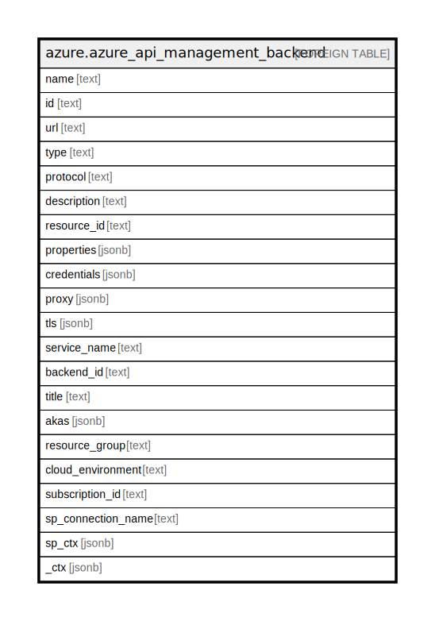

# azure.azure_api_management_backend

## Description

Azure API Management Backend

## Columns

| Name | Type | Default | Nullable | Children | Parents | Comment |
| ---- | ---- | ------- | -------- | -------- | ------- | ------- |
| name | text |  | true |  |  | A friendly name that identifies an API management backend. |
| id | text |  | true |  |  | Contains ID to identify an API management backend uniquely. |
| url | text |  | true |  |  | Runtime Url of the API management backend. |
| type | text |  | true |  |  | Resource type for API Management resource. |
| protocol | text |  | true |  |  | API management backend communication protocol. Possible values include: 'BackendProtocolHTTP', 'BackendProtocolSoap'. |
| description | text |  | true |  |  | The API management backend Description. |
| resource_id | text |  | true |  |  | Management Uri of the Resource in External System. This url can be the Arm Resource Id of Logic Apps, Function Apps or Api Apps. |
| properties | jsonb |  | true |  |  | The API management backend Properties contract. |
| credentials | jsonb |  | true |  |  | The API management backend credentials contract properties. |
| proxy | jsonb |  | true |  |  | The API management backend proxy contract properties. |
| tls | jsonb |  | true |  |  | The API management backend TLS properties. |
| service_name | text |  | true |  |  | Name of the API management service. |
| backend_id | text |  | true |  |  | The API management backend ID. |
| title | text |  | true |  |  | Title of the resource. |
| akas | jsonb |  | true |  |  | Array of globally unique identifier strings (also known as) for the resource. |
| resource_group | text |  | true |  |  | The resource group which holds this resource. |
| cloud_environment | text |  | true |  |  | The Azure Cloud Environment. |
| subscription_id | text |  | true |  |  | The Azure Subscription ID in which the resource is located. |
| sp_connection_name | text |  | true |  |  | Steampipe connection name. |
| sp_ctx | jsonb |  | true |  |  | Steampipe context in JSON form. |
| _ctx | jsonb |  | true |  |  | Steampipe context in JSON form. |

## Relations

---

> Generated by [tbls](https://github.com/k1LoW/tbls)
