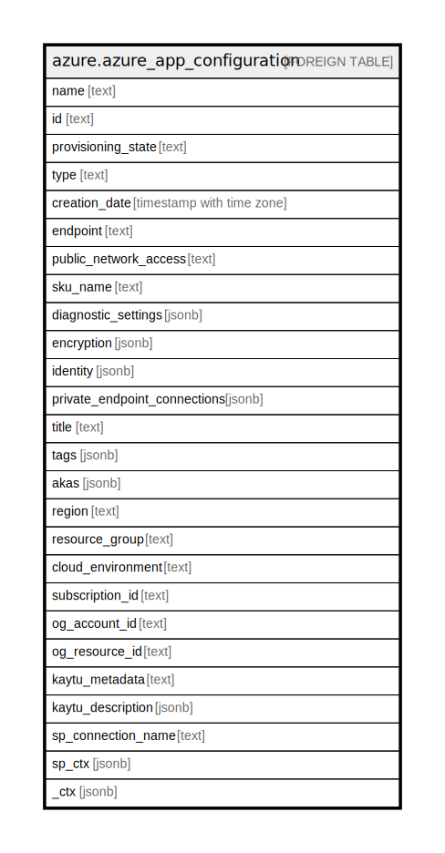

# azure.azure_app_configuration

## Description

Azure App Configuration

## Columns

| Name | Type | Default | Nullable | Children | Parents | Comment |
| ---- | ---- | ------- | -------- | -------- | ------- | ------- |
| name | text |  | true |  |  | The name of the resource. |
| id | text |  | true |  |  | The resource ID. |
| provisioning_state | text |  | true |  |  | The provisioning state of the configuration store. Possible values include: 'Creating', 'Updating', 'Deleting', 'Succeeded', 'Failed', 'Canceled'. |
| type | text |  | true |  |  | The type of the resource. |
| creation_date | timestamp with time zone |  | true |  |  | The creation date of configuration store. |
| endpoint | text |  | true |  |  | The DNS endpoint where the configuration store API will be available. |
| public_network_access | text |  | true |  |  | Control permission for data plane traffic coming from public networks while private endpoint is enabled. Possible values include: 'Enabled', 'Disabled'. |
| sku_name | text |  | true |  |  | The SKU name of the configuration store. |
| diagnostic_settings | jsonb |  | true |  |  | A list of active diagnostic settings for the configuration store. |
| encryption | jsonb |  | true |  |  | The encryption settings of the configuration store. |
| identity | jsonb |  | true |  |  | The managed identity information, if configured. |
| private_endpoint_connections | jsonb |  | true |  |  | The list of private endpoint connections that are set up for this resource. |
| title | text |  | true |  |  | Title of the resource. |
| tags | jsonb |  | true |  |  | A map of tags for the resource. |
| akas | jsonb |  | true |  |  | Array of globally unique identifier strings (also known as) for the resource. |
| region | text |  | true |  |  | The Azure region/location in which the resource is located. |
| resource_group | text |  | true |  |  | The resource group which holds this resource. |
| cloud_environment | text |  | true |  |  | The Azure Cloud Environment. |
| subscription_id | text |  | true |  |  | The Azure Subscription ID in which the resource is located. |
| og_account_id | text |  | true |  |  | The Platform Account ID in which the resource is located. |
| og_resource_id | text |  | true |  |  | The unique ID of the resource in opengovernance. |
| kaytu_metadata | text |  | true |  |  | Platform Metadata of the Azure resource. |
| kaytu_description | jsonb |  | true |  |  | The full model description of the resource |
| sp_connection_name | text |  | true |  |  | Steampipe connection name. |
| sp_ctx | jsonb |  | true |  |  | Steampipe context in JSON form. |
| _ctx | jsonb |  | true |  |  | Steampipe context in JSON form. |

## Relations

---

> Generated by [tbls](https://github.com/k1LoW/tbls)
