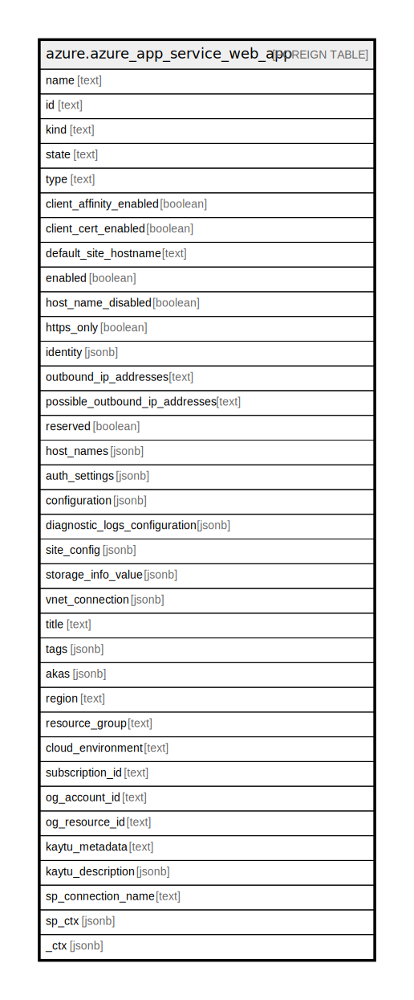

# azure.azure_app_service_web_app

## Description

Azure App Service Web App

## Columns

| Name | Type | Default | Nullable | Children | Parents | Comment |
| ---- | ---- | ------- | -------- | -------- | ------- | ------- |
| name | text |  | true |  |  | The friendly name that identifies the app service web app. |
| id | text |  | true |  |  | Contains ID to identify an app service web app uniquely. |
| kind | text |  | true |  |  | Contains the kind of the resource. |
| state | text |  | true |  |  | Current state of the app. |
| type | text |  | true |  |  | The resource type of the app service web app. |
| client_affinity_enabled | boolean |  | true |  |  | Specify whether client affinity is enabled. |
| client_cert_enabled | boolean |  | true |  |  | Specify whether client certificate authentication is enabled. |
| default_site_hostname | text |  | true |  |  | Default hostname of the app. |
| enabled | boolean |  | true |  |  | Specify whether the app is enabled. |
| host_name_disabled | boolean |  | true |  |  | Specify whether the public hostnames of the app is disabled. |
| https_only | boolean |  | true |  |  | Specify whether configuring a web site to accept only https requests. |
| identity | jsonb |  | true |  |  | Managed service identity for the resource. |
| outbound_ip_addresses | text |  | true |  |  | List of IP addresses that the app uses for outbound connections (e.g. database access). |
| possible_outbound_ip_addresses | text |  | true |  |  | List of possible IP addresses that the app uses for outbound connections (e.g. database access). |
| reserved | boolean |  | true |  |  | Specify whether the app is reserved. |
| host_names | jsonb |  | true |  |  | A list of hostnames associated with the app. |
| auth_settings | jsonb |  | true |  |  | Describes the Authentication/Authorization settings of an app. |
| configuration | jsonb |  | true |  |  | Describes the configuration of an app. |
| diagnostic_logs_configuration | jsonb |  | true |  |  | Describes the logging configuration of an app. |
| site_config | jsonb |  | true |  |  | A map of all configuration for the app. |
| storage_info_value | jsonb |  | true |  |  | AzureStorageInfoValue azure Files or Blob Storage access information value for dictionary storage. |
| vnet_connection | jsonb |  | true |  |  | Describes the virtual network connection for the app. |
| title | text |  | true |  |  | Title of the resource. |
| tags | jsonb |  | true |  |  | A map of tags for the resource. |
| akas | jsonb |  | true |  |  | Array of globally unique identifier strings (also known as) for the resource. |
| region | text |  | true |  |  | The Azure region/location in which the resource is located. |
| resource_group | text |  | true |  |  | The resource group which holds this resource. |
| cloud_environment | text |  | true |  |  | The Azure Cloud Environment. |
| subscription_id | text |  | true |  |  | The Azure Subscription ID in which the resource is located. |
| og_account_id | text |  | true |  |  | The Platform Account ID in which the resource is located. |
| og_resource_id | text |  | true |  |  | The unique ID of the resource in opengovernance. |
| kaytu_metadata | text |  | true |  |  | Platform Metadata of the Azure resource. |
| kaytu_description | jsonb |  | true |  |  | The full model description of the resource |
| sp_connection_name | text |  | true |  |  | Steampipe connection name. |
| sp_ctx | jsonb |  | true |  |  | Steampipe context in JSON form. |
| _ctx | jsonb |  | true |  |  | Steampipe context in JSON form. |

## Relations

---

> Generated by [tbls](https://github.com/k1LoW/tbls)
