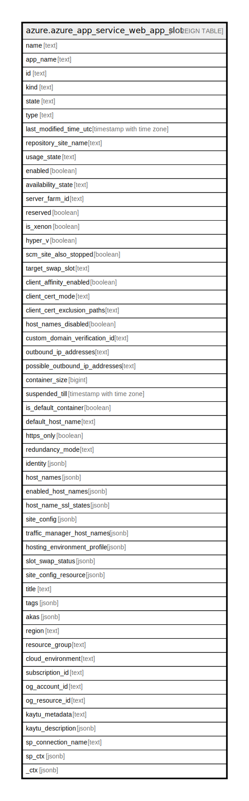

# azure.azure_app_service_web_app_slot

## Description

Azure App Service Web App Slot

## Columns

| Name | Type | Default | Nullable | Children | Parents | Comment |
| ---- | ---- | ------- | -------- | -------- | ------- | ------- |
| name | text |  | true |  |  | Resource Name. |
| app_name | text |  | true |  |  | The name of the application. |
| id | text |  | true |  |  | Resource ID of the app slot. |
| kind | text |  | true |  |  | Contains the kind of the resource. |
| state | text |  | true |  |  | Current state of the app. |
| type | text |  | true |  |  | Resource type. |
| last_modified_time_utc | timestamp with time zone |  | true |  |  | Last time the app was modified, in UTC. |
| repository_site_name | text |  | true |  |  | Name of the repository site. |
| usage_state | text |  | true |  |  | State indicating whether the app has exceeded its quota usage. Read-only. Possible values include: 'UsageStateNormal', 'UsageStateExceeded'. |
| enabled | boolean |  | true |  |  | Indicates wheather the app is enabled. |
| availability_state | text |  | true |  |  | Management information availability state for the app. Possible values include: 'Normal', 'Limited', 'DisasterRecoveryMode'. |
| server_farm_id | text |  | true |  |  | Resource ID of the associated App Service plan, formatted as: '/subscriptions/{subscriptionID}/resourceGroups/{groupName}/providers/Microsoft.Web/serverfarms/{appServicePlanName}'. |
| reserved | boolean |  | true |  |  | True if reserved; otherwise, false. |
| is_xenon | boolean |  | true |  |  | Obsolete: Hyper-V sandbox. |
| hyper_v | boolean |  | true |  |  | Hyper-V sandbox. |
| scm_site_also_stopped | boolean |  | true |  |  | True to stop SCM (KUDU) site when the app is stopped; otherwise, false. The default is false. |
| target_swap_slot | text |  | true |  |  | Specifies which deployment slot this app will swap into. |
| client_affinity_enabled | boolean |  | true |  |  | True to enable client affinity; false to stop sending session affinity cookies, which route client requests in the same session to the same instance. Default is true. |
| client_cert_mode | text |  | true |  |  | This composes with ClientCertEnabled setting. ClientCertEnabled: false means ClientCert is ignored. ClientCertEnabled: true and ClientCertMode: Required means ClientCert is required.ClientCertEnabled: true and ClientCertMode: Optional means ClientCert is optional or accepted. Possible values include: 'Required', 'Optional'. |
| client_cert_exclusion_paths | text |  | true |  |  | Client certificate authentication comma-separated exclusion paths. |
| host_names_disabled | boolean |  | true |  |  | True to disable the public hostnames of the app; otherwise, false. If true, the app is only accessible via API management process. |
| custom_domain_verification_id | text |  | true |  |  | Unique identifier that verifies the custom domains assigned to the app. The customer will add this ID to a text record for verification. |
| outbound_ip_addresses | text |  | true |  |  | List of IP addresses that the app uses for outbound connections (e.g. database access). Includes VIPs from tenants that site can be hosted with current settings. |
| possible_outbound_ip_addresses | text |  | true |  |  | List of IP addresses that the app uses for outbound connections (e.g. database access). Includes VIPs from all tenants except dataComponent. |
| container_size | bigint |  | true |  |  | Size of the function container. |
| suspended_till | timestamp with time zone |  | true |  |  | App suspended till in case memory-time quota is exceeded. |
| is_default_container | boolean |  | true |  |  | True if the app is a default container; otherwise, false. |
| default_host_name | text |  | true |  |  | Default hostname of the app. |
| https_only | boolean |  | true |  |  | Configures a web site to accept only https requests. |
| redundancy_mode | text |  | true |  |  | Site redundancy mode. Possible values include: 'RedundancyModeNone', 'RedundancyModeManual', 'RedundancyModeFailover', 'RedundancyModeActiveActive', 'RedundancyModeGeoRedundant'. |
| identity | jsonb |  | true |  |  | Managed service identity. |
| host_names | jsonb |  | true |  |  | Hostnames associated with the app. |
| enabled_host_names | jsonb |  | true |  |  | Enabled hostnames for the app. Hostnames need to be assigned (see HostNames) AND enabled. Otherwise, the app is not served on those hostnames. |
| host_name_ssl_states | jsonb |  | true |  |  | Hostname SSL states are used to manage the SSL bindings for app's hostnames. |
| site_config | jsonb |  | true |  |  | Configuration of the app. |
| traffic_manager_host_names | jsonb |  | true |  |  | Azure Traffic Manager hostnames associated with the app. |
| hosting_environment_profile | jsonb |  | true |  |  | App Service Environment to use for the app. |
| slot_swap_status | jsonb |  | true |  |  | Status of the last deployment slot swap operation. |
| site_config_resource | jsonb |  | true |  |  | Configuration of an app, such as platform version and bitness, default documents, virtual applications, Always On, etc. |
| title | text |  | true |  |  | Title of the resource. |
| tags | jsonb |  | true |  |  | A map of tags for the resource. |
| akas | jsonb |  | true |  |  | Array of globally unique identifier strings (also known as) for the resource. |
| region | text |  | true |  |  | The Azure region/location in which the resource is located. |
| resource_group | text |  | true |  |  | The resource group which holds this resource. |
| cloud_environment | text |  | true |  |  | The Azure Cloud Environment. |
| subscription_id | text |  | true |  |  | The Azure Subscription ID in which the resource is located. |
| og_account_id | text |  | true |  |  | The Platform Account ID in which the resource is located. |
| og_resource_id | text |  | true |  |  | The unique ID of the resource in opengovernance. |
| kaytu_metadata | text |  | true |  |  | Platform Metadata of the Azure resource. |
| kaytu_description | jsonb |  | true |  |  | The full model description of the resource |
| sp_connection_name | text |  | true |  |  | Steampipe connection name. |
| sp_ctx | jsonb |  | true |  |  | Steampipe context in JSON form. |
| _ctx | jsonb |  | true |  |  | Steampipe context in JSON form. |

## Relations

---

> Generated by [tbls](https://github.com/k1LoW/tbls)
