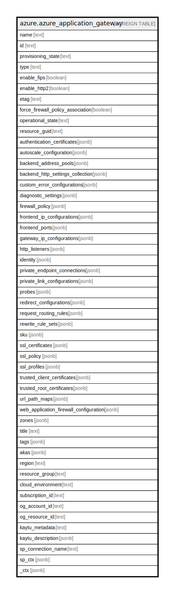

# azure.azure_application_gateway

## Description

Azure Application Gateway

## Columns

| Name | Type | Default | Nullable | Children | Parents | Comment |
| ---- | ---- | ------- | -------- | -------- | ------- | ------- |
| name | text |  | true |  |  | The resource name. |
| id | text |  | true |  |  | The resource ID. |
| provisioning_state | text |  | true |  |  | The provisioning state of the application gateway. Possible values include: 'Succeeded', 'Updating', 'Deleting', 'Failed'. |
| type | text |  | true |  |  | The resource type. |
| enable_fips | boolean |  | true |  |  | Whether FIPS is enabled on the application gateway. |
| enable_http2 | boolean |  | true |  |  | Whether HTTP2 is enabled on the application gateway. |
| etag | text |  | true |  |  | A unique read-only string that changes whenever the resource is updated. |
| force_firewall_policy_association | boolean |  | true |  |  | If true, associates a firewall policy with an application gateway regardless whether the policy differs from the WAF configuration. |
| operational_state | text |  | true |  |  | Operational state of the application gateway. Possible values include: 'Stopped', 'Starting', 'Running', 'Stopping'. |
| resource_guid | text |  | true |  |  | The resource GUID property of the application gateway. |
| authentication_certificates | jsonb |  | true |  |  | Authentication certificates of the application gateway. |
| autoscale_configuration | jsonb |  | true |  |  | Autoscale Configuration of the application gateway. |
| backend_address_pools | jsonb |  | true |  |  | Backend address pool of the application gateway. |
| backend_http_settings_collection | jsonb |  | true |  |  | Backend http settings of the application gateway. |
| custom_error_configurations | jsonb |  | true |  |  | Custom error configurations of the application gateway. |
| diagnostic_settings | jsonb |  | true |  |  | A list of active diagnostic settings for the application gateway. |
| firewall_policy | jsonb |  | true |  |  | Reference to the FirewallPolicy resource. |
| frontend_ip_configurations | jsonb |  | true |  |  | Frontend IP addresses of the application gateway. |
| frontend_ports | jsonb |  | true |  |  | Frontend ports of the application gateway. |
| gateway_ip_configurations | jsonb |  | true |  |  | Subnets of the application gateway. |
| http_listeners | jsonb |  | true |  |  | Http listeners of the application gateway. |
| identity | jsonb |  | true |  |  | The identity of the application gateway, if configured. |
| private_endpoint_connections | jsonb |  | true |  |  | Private endpoint connections on application gateway. |
| private_link_configurations | jsonb |  | true |  |  | PrivateLink configurations on application gateway. |
| probes | jsonb |  | true |  |  | Probes of the application gateway. |
| redirect_configurations | jsonb |  | true |  |  | Redirect configurations of the application gateway. |
| request_routing_rules | jsonb |  | true |  |  | Request routing rules of the application gateway. |
| rewrite_rule_sets | jsonb |  | true |  |  | Rewrite rules for the application gateway. |
| sku | jsonb |  | true |  |  | SKU of the application gateway. |
| ssl_certificates | jsonb |  | true |  |  | SSL certificates of the application gateway. |
| ssl_policy | jsonb |  | true |  |  | SSL policy of the application gateway. |
| ssl_profiles | jsonb |  | true |  |  | SSL profiles of the application gateway. |
| trusted_client_certificates | jsonb |  | true |  |  | Trusted client certificates of the application gateway. |
| trusted_root_certificates | jsonb |  | true |  |  | Trusted root certificates of the application gateway. |
| url_path_maps | jsonb |  | true |  |  | URL path map of the application gateway. |
| web_application_firewall_configuration | jsonb |  | true |  |  | Web application firewall configuration of the application gateway. |
| zones | jsonb |  | true |  |  | A list of availability zones denoting where the resource needs to come from. |
| title | text |  | true |  |  | Title of the resource. |
| tags | jsonb |  | true |  |  | A map of tags for the resource. |
| akas | jsonb |  | true |  |  | Array of globally unique identifier strings (also known as) for the resource. |
| region | text |  | true |  |  | The Azure region/location in which the resource is located. |
| resource_group | text |  | true |  |  | The resource group which holds this resource. |
| cloud_environment | text |  | true |  |  | The Azure Cloud Environment. |
| subscription_id | text |  | true |  |  | The Azure Subscription ID in which the resource is located. |
| og_account_id | text |  | true |  |  | The Platform Account ID in which the resource is located. |
| og_resource_id | text |  | true |  |  | The unique ID of the resource in opengovernance. |
| kaytu_metadata | text |  | true |  |  | Platform Metadata of the Azure resource. |
| kaytu_description | jsonb |  | true |  |  | The full model description of the resource |
| sp_connection_name | text |  | true |  |  | Steampipe connection name. |
| sp_ctx | jsonb |  | true |  |  | Steampipe context in JSON form. |
| _ctx | jsonb |  | true |  |  | Steampipe context in JSON form. |

## Relations

---

> Generated by [tbls](https://github.com/k1LoW/tbls)
