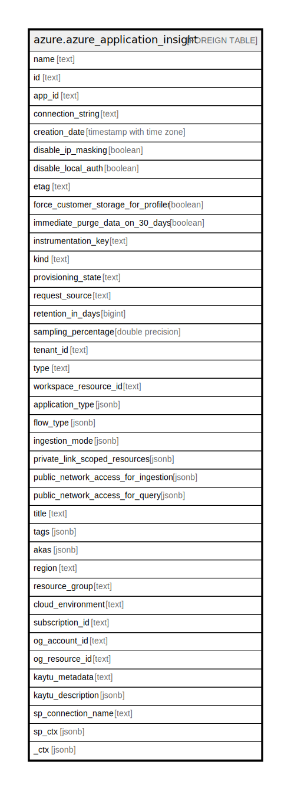

# azure.azure_application_insight

## Description

Azure Application Insight

## Columns

| Name | Type | Default | Nullable | Children | Parents | Comment |
| ---- | ---- | ------- | -------- | -------- | ------- | ------- |
| name | text |  | true |  |  | The friendly name that identifies the application insight. |
| id | text |  | true |  |  | Contains id to identify the application insight uniquely. |
| app_id | text |  | true |  |  | Application insights unique id for your Application. |
| connection_string | text |  | true |  |  | Application Insights component connection string. |
| creation_date | timestamp with time zone |  | true |  |  | Creation date for the Application Insights component. |
| disable_ip_masking | boolean |  | true |  |  | Disable IP masking. |
| disable_local_auth | boolean |  | true |  |  | Disable Non-AAD based Auth. |
| etag | text |  | true |  |  | A unique read-only string that changes whenever the resource is updated. |
| force_customer_storage_for_profiler | boolean |  | true |  |  | Force users to create their own storage account for profiler and debugger. |
| immediate_purge_data_on_30_days | boolean |  | true |  |  | Purge data immediately after 30 days. |
| instrumentation_key | text |  | true |  |  | Application Insights Instrumentation key. |
| kind | text |  | true |  |  | The kind of application that this component refers to, used to customize UI. |
| provisioning_state | text |  | true |  |  | Current state of this component. |
| request_source | text |  | true |  |  | Describes what tool created this Application Insights component. |
| retention_in_days | bigint |  | true |  |  | Retention period in days. |
| sampling_percentage | double precision |  | true |  |  | Percentage of the data produced by the application being monitored that is being sampled for Application Insights telemetry. |
| tenant_id | text |  | true |  |  | Azure Tenant ID. |
| type | text |  | true |  |  | The resource type of the application insight. |
| workspace_resource_id | text |  | true |  |  | Resource Id of the log analytics workspace to which the data will be ingested. |
| application_type | jsonb |  | true |  |  | Type of application being monitored. |
| flow_type | jsonb |  | true |  |  | Determines what kind of flow this component was created by. |
| ingestion_mode | jsonb |  | true |  |  | Indicates the flow of the ingestion. |
| private_link_scoped_resources | jsonb |  | true |  |  | List of linked private link scope resources. |
| public_network_access_for_ingestion | jsonb |  | true |  |  | The network access type for accessing Application Insights ingestion. |
| public_network_access_for_query | jsonb |  | true |  |  | The network access type for accessing Application Insights query. |
| title | text |  | true |  |  | Title of the resource. |
| tags | jsonb |  | true |  |  | A map of tags for the resource. |
| akas | jsonb |  | true |  |  | Array of globally unique identifier strings (also known as) for the resource. |
| region | text |  | true |  |  | The Azure region/location in which the resource is located. |
| resource_group | text |  | true |  |  | The resource group which holds this resource. |
| cloud_environment | text |  | true |  |  | The Azure Cloud Environment. |
| subscription_id | text |  | true |  |  | The Azure Subscription ID in which the resource is located. |
| og_account_id | text |  | true |  |  | The Platform Account ID in which the resource is located. |
| og_resource_id | text |  | true |  |  | The unique ID of the resource in opengovernance. |
| kaytu_metadata | text |  | true |  |  | Platform Metadata of the Azure resource. |
| kaytu_description | jsonb |  | true |  |  | The full model description of the resource |
| sp_connection_name | text |  | true |  |  | Steampipe connection name. |
| sp_ctx | jsonb |  | true |  |  | Steampipe context in JSON form. |
| _ctx | jsonb |  | true |  |  | Steampipe context in JSON form. |

## Relations

---

> Generated by [tbls](https://github.com/k1LoW/tbls)
