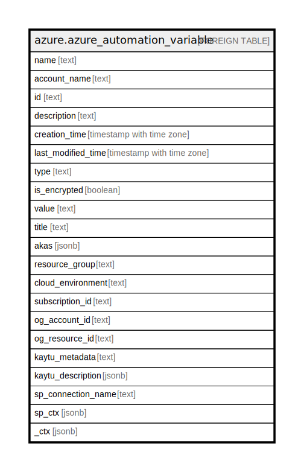

# azure.azure_automation_variable

## Description

Azure Automation Variable

## Columns

| Name | Type | Default | Nullable | Children | Parents | Comment |
| ---- | ---- | ------- | -------- | -------- | ------- | ------- |
| name | text |  | true |  |  | The name of the resource. |
| account_name | text |  | true |  |  | The name of the account. |
| id | text |  | true |  |  | Fully qualified resource ID. |
| description | text |  | true |  |  | The description for the variable. |
| creation_time | timestamp with time zone |  | true |  |  | The creation time of the variable. |
| last_modified_time | timestamp with time zone |  | true |  |  | The last modified time of the variable. |
| type | text |  | true |  |  | The type of the resource. |
| is_encrypted | boolean |  | true |  |  | The encrypted flag of the variable. |
| value | text |  | true |  |  | The value of the variable. |
| title | text |  | true |  |  | Title of the resource. |
| akas | jsonb |  | true |  |  | Array of globally unique identifier strings (also known as) for the resource. |
| resource_group | text |  | true |  |  | The resource group which holds this resource. |
| cloud_environment | text |  | true |  |  | The Azure Cloud Environment. |
| subscription_id | text |  | true |  |  | The Azure Subscription ID in which the resource is located. |
| og_account_id | text |  | true |  |  | The Platform Account ID in which the resource is located. |
| og_resource_id | text |  | true |  |  | The unique ID of the resource in opengovernance. |
| kaytu_metadata | text |  | true |  |  | Platform Metadata of the Azure resource. |
| kaytu_description | jsonb |  | true |  |  | The full model description of the resource |
| sp_connection_name | text |  | true |  |  | Steampipe connection name. |
| sp_ctx | jsonb |  | true |  |  | Steampipe context in JSON form. |
| _ctx | jsonb |  | true |  |  | Steampipe context in JSON form. |

## Relations

---

> Generated by [tbls](https://github.com/k1LoW/tbls)
