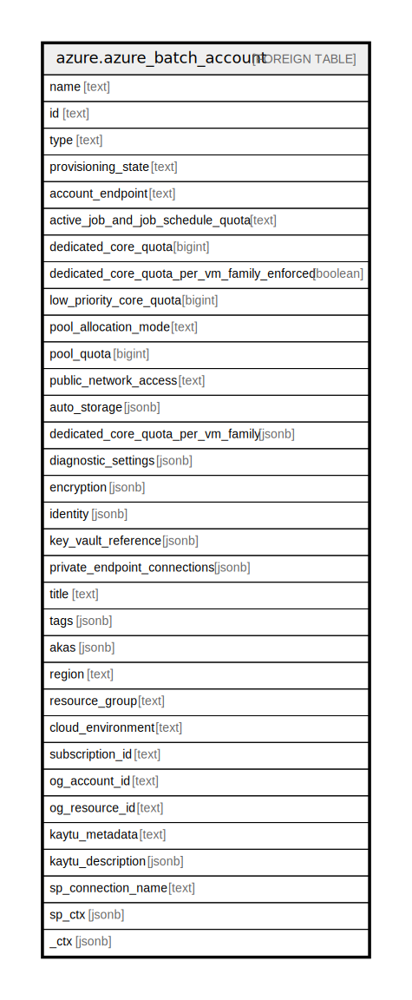

# azure.azure_batch_account

## Description

Azure Batch Account

## Columns

| Name | Type | Default | Nullable | Children | Parents | Comment |
| ---- | ---- | ------- | -------- | -------- | ------- | ------- |
| name | text |  | true |  |  | The resource name. |
| id | text |  | true |  |  | The resource identifier. |
| type | text |  | true |  |  | The resource type. |
| provisioning_state | text |  | true |  |  | The provisioned state of the batch account. |
| account_endpoint | text |  | true |  |  | The account endpoint used to interact with the batch service. |
| active_job_and_job_schedule_quota | text |  | true |  |  | Active job and job schedule quota of the batch account. |
| dedicated_core_quota | bigint |  | true |  |  | The dedicated core quota of the batch account. |
| dedicated_core_quota_per_vm_family_enforced | boolean |  | true |  |  | Batch is transitioning its core quota system for dedicated cores to be enforced per Virtual Machine family. During this transitional phase, the dedicated core quota per Virtual Machine family may not yet be enforced. |
| low_priority_core_quota | bigint |  | true |  |  | The low priority core quota of the batch account. |
| pool_allocation_mode | text |  | true |  |  | The pool allocation mode of the batch account. |
| pool_quota | bigint |  | true |  |  | The pool quota of the batch account. |
| public_network_access | text |  | true |  |  | Indicates whether or not public network access is allowed for the batch account. |
| auto_storage | jsonb |  | true |  |  | The auto storage properties of the batch account. |
| dedicated_core_quota_per_vm_family | jsonb |  | true |  |  | A list of the dedicated core quota per virtual machine family for the batch account. |
| diagnostic_settings | jsonb |  | true |  |  | A list of active diagnostic settings for the batch account. |
| encryption | jsonb |  | true |  |  | Properties to enable customer managed key for the batch account. |
| identity | jsonb |  | true |  |  | The identity of the batch account. |
| key_vault_reference | jsonb |  | true |  |  | Key vault reference of the batch account. |
| private_endpoint_connections | jsonb |  | true |  |  | The properties associated with the private endpoint connection. |
| title | text |  | true |  |  | Title of the resource. |
| tags | jsonb |  | true |  |  | A map of tags for the resource. |
| akas | jsonb |  | true |  |  | Array of globally unique identifier strings (also known as) for the resource. |
| region | text |  | true |  |  | The Azure region/location in which the resource is located. |
| resource_group | text |  | true |  |  | The resource group which holds this resource. |
| cloud_environment | text |  | true |  |  | The Azure Cloud Environment. |
| subscription_id | text |  | true |  |  | The Azure Subscription ID in which the resource is located. |
| og_account_id | text |  | true |  |  | The Platform Account ID in which the resource is located. |
| og_resource_id | text |  | true |  |  | The unique ID of the resource in opengovernance. |
| kaytu_metadata | text |  | true |  |  | Platform Metadata of the Azure resource. |
| kaytu_description | jsonb |  | true |  |  | The full model description of the resource |
| sp_connection_name | text |  | true |  |  | Steampipe connection name. |
| sp_ctx | jsonb |  | true |  |  | Steampipe context in JSON form. |
| _ctx | jsonb |  | true |  |  | Steampipe context in JSON form. |

## Relations

---

> Generated by [tbls](https://github.com/k1LoW/tbls)
